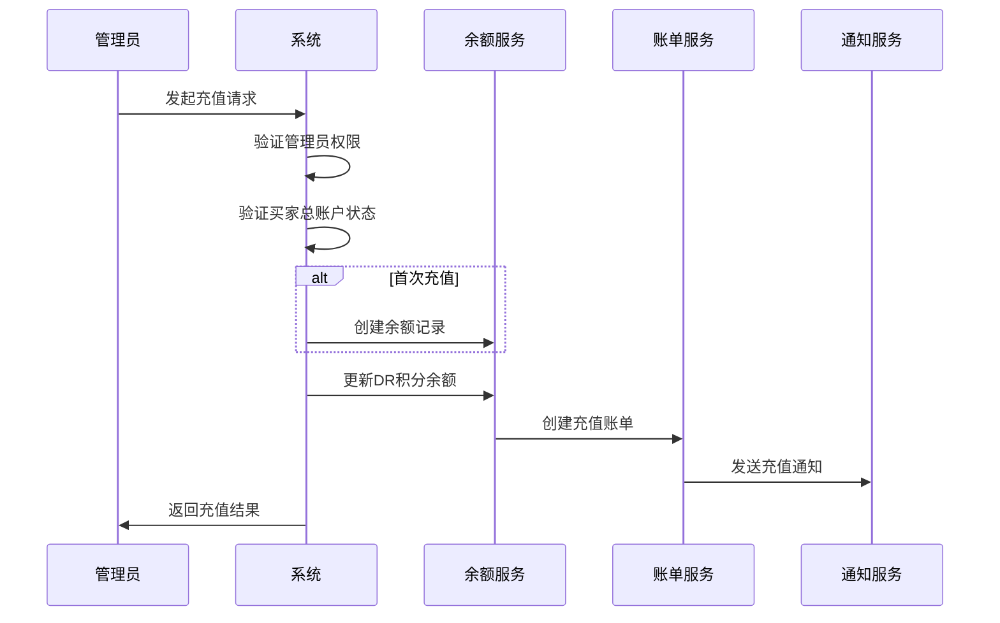
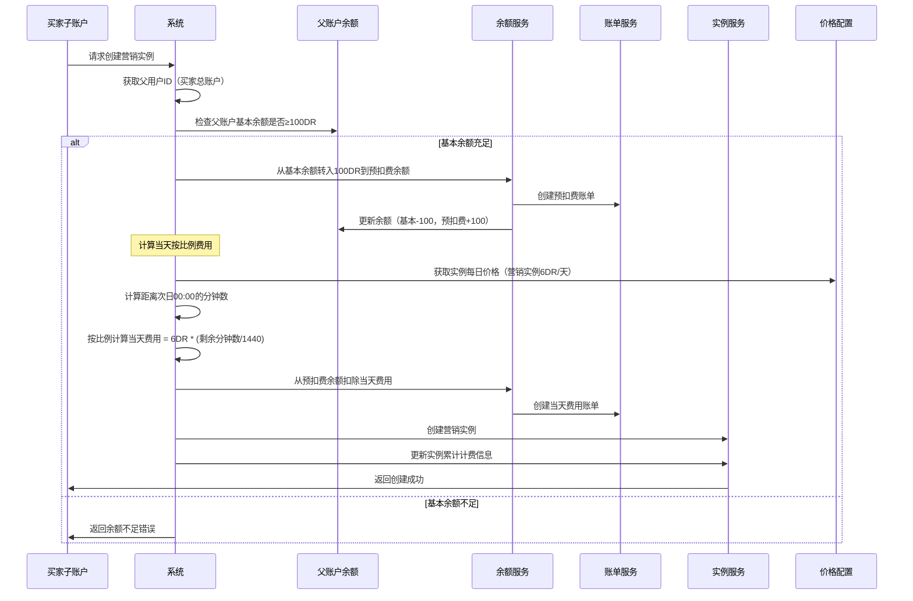
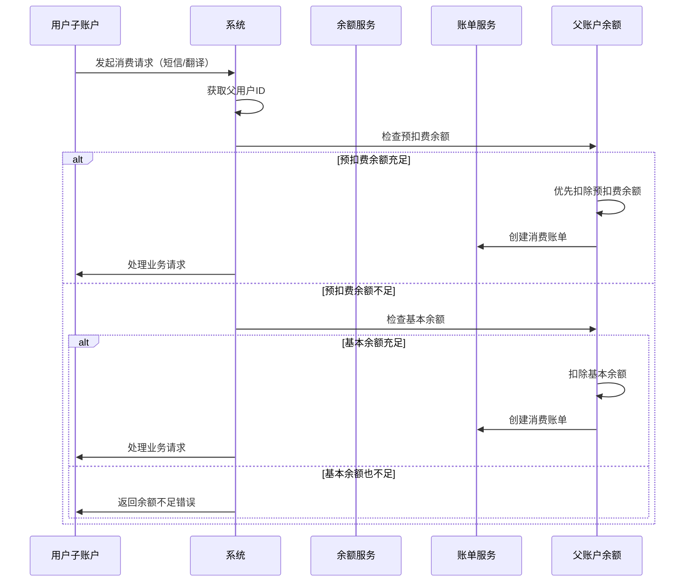
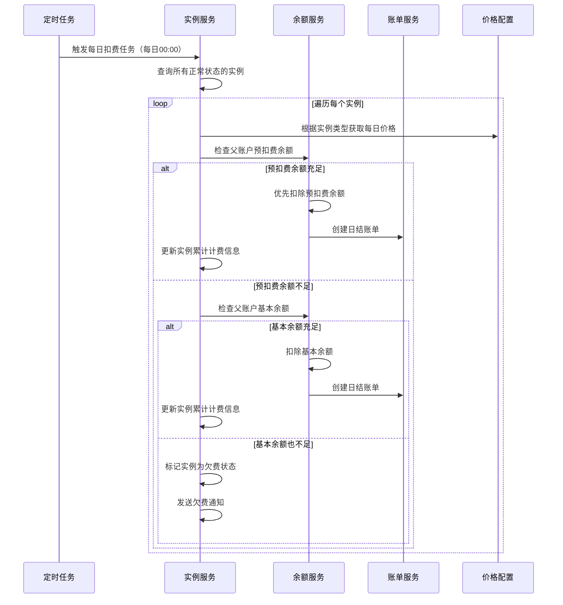

# 账户体系最终实现方案

## 一、概述

本文档基于DeepReach系统的现有用户体系，设计了一套完整的DR积分账户管理系统。该系统支持买家总账户的DR积分充值、消费、退款等全生命周期管理，包括实时扣费和定时扣费两种结算模式，以及完整的账单记录体系。

### 1.1 核心业务需求

1. **DR积分余额管理**：只有买家总账户类型的用户拥有DR积分余额
2. **充值功能**：管理员通过后台接口为买家总账户充值DR积分
3. **预扣费机制**：买家子账户创建营销实例时，预扣100DR积分作为预扣费余额
4. **消费扣费**：支持秒结秒扣和日结日扣两种扣费模式，优先使用预扣费余额
5. **账单记录**：完整记录每一笔DR积分变动，包括预扣费操作
6. **实例创建规则**：
   - 买家总账户每100DR积分可创建1个营销实例（由其直属子账户创建）
   - 每个营销实例创建时，从买家总账户余额中预扣100DR作为预扣费余额
   - 每个营销实例可解锁各平台10个拓客实例
   - 买家子账户的所有消费行为优先扣除预扣费余额，预扣费余额不足时再扣除基本余额

### 1.2 现有用户体系分析

基于现有代码分析，系统已具备以下基础：

- **用户表(sys_user)**：支持买家总账户和子账户类型
- **部门表(sys_dept)**：通过dept_type区分用户类型（3-买家总账户，4-买家子账户）
- **实例表(instance)**：支持营销和拓客两种实例类型
- **层级关系**：通过parent_user_id建立买家总账户与子账户的父子关系

## 二、数据库表结构设计

### 2.1 DR积分余额表

#### 表名：`user_dr_balance`

```sql
CREATE TABLE `user_dr_balance` (
    `balance_id` BIGINT(20) NOT NULL AUTO_INCREMENT COMMENT '余额ID',
    `user_id` BIGINT(20) NOT NULL COMMENT '用户ID（买家总账户）',
    `dr_balance` DECIMAL(15,4) NOT NULL DEFAULT 0.0000 COMMENT 'DR积分余额',
    `pre_deducted_balance` DECIMAL(15,4) NOT NULL DEFAULT 0.0000 COMMENT '预扣费余额（营销实例创建时预扣的费用）',
    `total_recharge` DECIMAL(15,4) NOT NULL DEFAULT 0.0000 COMMENT '累计充值金额',
    `total_consume` DECIMAL(15,4) NOT NULL DEFAULT 0.0000 COMMENT '累计消费金额',
    `total_refund` DECIMAL(15,4) NOT NULL DEFAULT 0.0000 COMMENT '累计退款金额',
    `frozen_amount` DECIMAL(15,4) NOT NULL DEFAULT 0.0000 COMMENT '冻结金额',
    `version` INT(11) NOT NULL DEFAULT 0 COMMENT '版本号（乐观锁）',
    `status` CHAR(1) DEFAULT '0' COMMENT '状态（0正常 1冻结 2注销）',
    `create_time` DATETIME NOT NULL DEFAULT CURRENT_TIMESTAMP COMMENT '创建时间',
    `update_time` DATETIME NOT NULL DEFAULT CURRENT_TIMESTAMP ON UPDATE CURRENT_TIMESTAMP COMMENT '更新时间',
    `create_by` VARCHAR(64) DEFAULT '' COMMENT '创建者',
    `update_by` VARCHAR(64) DEFAULT '' COMMENT '更新者',
    `remark` VARCHAR(500) DEFAULT NULL COMMENT '备注',
    PRIMARY KEY (`balance_id`),
    UNIQUE KEY `uk_user_id` (`user_id`),
    KEY `idx_status` (`status`),
    KEY `idx_create_time` (`create_time`),
    CONSTRAINT `fk_balance_user` FOREIGN KEY (`user_id`) REFERENCES `sys_user` (`user_id`) ON DELETE CASCADE
) ENGINE=InnoDB DEFAULT CHARSET=utf8mb4 COMMENT='用户DR积分余额表';
```

**字段说明：**
- `user_id`：关联买家总账户用户，一对一关系
- `dr_balance`：当前DR积分余额，保留4位小数（可用余额）
- `pre_deducted_balance`：预扣费余额，营销实例创建时预扣的DR积分
- `version`：乐观锁版本号，防止并发更新问题
- `frozen_amount`：冻结金额，用于处理正在进行的交易

**业务规则：**
1. 买家总账户第一次充值时自动创建余额记录
2. 所有余额变动操作都需要检查余额充足性
3. 使用乐观锁防止并发问题
4. 买家子账户创建营销实例时，从买家总账户的基本余额转入100DR到预扣费余额
5. 买家子账户的所有消费行为优先扣除预扣费余额，预扣费余额不足时再扣除基本余额
6. 可用余额 = dr_balance - frozen_amount
7. 总可用余额 = dr_balance + pre_deducted_balance - frozen_amount

### 2.2 账单记录表

#### 表名：`dr_billing_record`

```sql
CREATE TABLE `dr_billing_record` (
    `bill_id` BIGINT(20) NOT NULL AUTO_INCREMENT COMMENT '账单ID',
    `bill_no` VARCHAR(32) NOT NULL COMMENT '账单编号',
    `user_id` BIGINT(20) NOT NULL COMMENT '用户ID（买家总账户）',
    `operator_id` BIGINT(20) NOT NULL COMMENT '操作者ID（管理员）',
    `bill_type` TINYINT(1) NOT NULL COMMENT '账单类型（1充值 2消费 3退款）',
    `billing_type` TINYINT(1) NOT NULL COMMENT '结算类型（1秒结秒扣 2日结日扣）',
    `business_type` VARCHAR(20) NOT NULL COMMENT '业务类型（RECHARGE充值, INSTANCE_PRE_DEDUCT营销实例预扣, INSTANCE营销实例, PROSPECTING拓客实例, SMS短信, TOKEN翻译token）',
    `business_id` BIGINT(20) DEFAULT NULL COMMENT '业务关联ID',
    `dr_amount` DECIMAL(15,4) NOT NULL COMMENT 'DR积分数量',
    `balance_before` DECIMAL(15,4) NOT NULL COMMENT '操作前余额',
    `balance_after` DECIMAL(15,4) NOT NULL COMMENT '操作后余额',
    `description` VARCHAR(200) DEFAULT NULL COMMENT '描述',
    `extra_data` JSON DEFAULT NULL COMMENT '扩展数据',
    `status` TINYINT(1) DEFAULT '1' COMMENT '状态（1成功 0失败）',
    `create_time` DATETIME NOT NULL DEFAULT CURRENT_TIMESTAMP COMMENT '创建时间',
    `create_by` VARCHAR(64) DEFAULT '' COMMENT '创建者',
    PRIMARY KEY (`bill_id`),
    UNIQUE KEY `uk_bill_no` (`bill_no`),
    KEY `idx_user_id` (`user_id`),
    KEY `idx_operator_id` (`operator_id`),
    KEY `idx_bill_type` (`bill_type`),
    KEY `idx_billing_type` (`billing_type`),
    KEY `idx_business_type` (`business_type`),
    KEY `idx_business_id` (`business_id`),
    KEY `idx_create_time` (`create_time`),
    KEY `idx_status` (`status`),
    CONSTRAINT `fk_billing_user` FOREIGN KEY (`user_id`) REFERENCES `sys_user` (`user_id`) ON DELETE CASCADE,
    CONSTRAINT `fk_billing_operator` FOREIGN KEY (`operator_id`) REFERENCES `sys_user` (`user_id`) ON DELETE CASCADE
) ENGINE=InnoDB DEFAULT CHARSET=utf8mb4 COMMENT='DR积分账单记录表';
```

**字段说明：**
- `bill_no`：账单编号，格式：DR + 年月日时分秒 + 序号（如DR202510301200001）
- `business_type`：业务类型，用于区分不同的消费场景
- `extra_data`：JSON格式，存储额外的业务信息（如短信内容、token数量等）

**账单类型枚举：**
1. 充值（RECHARGE）
2. 营销实例（INSTANCE）
3. 拓客实例（PROSPECTING）
4. 短信（SMS）
5. 翻译token（TOKEN）

### 2.3 消费行为价格表

#### 表名：`dr_price_config`

```sql
CREATE TABLE `dr_price_config` (
    `price_id` BIGINT(20) NOT NULL AUTO_INCREMENT COMMENT '价格ID',
    `business_type` VARCHAR(20) NOT NULL COMMENT '业务类型',
    `business_name` VARCHAR(50) NOT NULL COMMENT '业务名称',
    `price_unit` VARCHAR(20) NOT NULL COMMENT '计价单位',
    `dr_price` DECIMAL(15,4) NOT NULL COMMENT 'DR积分单价',
    `billing_type` TINYINT(1) NOT NULL COMMENT '结算类型（1秒结秒扣 2日结日扣）',
    `status` CHAR(1) DEFAULT '0' COMMENT '状态（0正常 1停用）',
    `create_time` DATETIME NOT NULL DEFAULT CURRENT_TIMESTAMP COMMENT '创建时间',
    `update_time` DATETIME NOT NULL DEFAULT CURRENT_TIMESTAMP ON UPDATE CURRENT_TIMESTAMP COMMENT '更新时间',
    `create_by` VARCHAR(64) DEFAULT '' COMMENT '创建者',
    `update_by` VARCHAR(64) DEFAULT '' COMMENT '更新者',
    `remark` VARCHAR(500) DEFAULT NULL COMMENT '备注',
    PRIMARY KEY (`price_id`),
    UNIQUE KEY `uk_business_type` (`business_type`),
    KEY `idx_status` (`status`),
    KEY `idx_billing_type` (`billing_type`)
) ENGINE=InnoDB DEFAULT CHARSET=utf8mb4 COMMENT='DR积分价格配置表';
```

**初始数据：**

```sql
INSERT INTO `dr_price_config` (`business_type`, `business_name`, `price_unit`, `dr_price`, `billing_type`, `create_by`, `remark`) VALUES
('INSTANCE_PRE_DEDUCT', '营销实例预扣费', 'DR/个', 100.0000, 1, 'admin', '创建每个营销实例预扣100DR积分'),
('INSTANCE_MARKETING', '营销实例', 'DR/天', 6.0000, 2, 'admin', '每个营销实例每天6DR积分'),
('INSTANCE_PROSPECTING', '拓客实例', 'DR/天', 1.0000, 2, 'admin', '每个拓客实例每天1DR积分'),
('SMS', '短信服务', 'DR/条', 0.0500, 1, 'admin', '每条短信0.05DR积分'),
('TOKEN', 'AI服务', 'DR/token', 0.0001, 1, 'admin', '每个token 0.0001DR积分');
```

### 2.4 实例表扩展说明

现有的 `instance` 表需要扩展以下字段来支持DR积分计费：

```sql
ALTER TABLE `instance`
ADD COLUMN `total_billed_days` INT(10) DEFAULT 0 COMMENT '累计计费天数' AFTER `platform_id`,
ADD COLUMN `total_billed_amount` DECIMAL(15,4) DEFAULT 0.0000 COMMENT '累计计费金额（DR积分）' AFTER `total_billed_days`;

-- 添加索引
ALTER TABLE `instance`
ADD KEY `idx_total_billed_days` (`total_billed_days`);
```

**字段说明：**
- `total_billed_days`：累计计费天数，用于统计
- `total_billed_amount`：累计计费金额，用于统计

**其他信息获取方式：**
- **每日价格**：通过实例类型（instance_type）查询 `dr_price_config` 表获取
- **最后计费时间**：统一在每天00:00进行，无需单独存储最后计费日期
- **父用户ID**：通过连接查询 `sys_user` 表获取用户的 `parent_id`

## 三、核心业务逻辑设计

### 3.1 DR积分充值流程



### 3.2 营销实例创建流程



**创建当天按比例计费逻辑：**

1. **计费原则**：实例创建当天按剩余时间比例计费
2. **计算公式**：当天费用 = 每日价格 × (距离次日00:00的分钟数 ÷ 1440)
3. **扣费时机**：实例创建成功后立即扣除当天费用
4. **扣费来源**：优先从预扣费余额中扣除
5. **示例**：
   - 营销实例每日价格：6DR
   - 如果在12:00（中午12点）创建，距离次日00:00还有720分钟
   - 当天费用 = 6DR × (720 ÷ 1440) = 3DR

### 3.3 实时扣费流程（短信、Token消费）



### 3.4 定时扣费流程（实例日结）



**日结扣费规则：**

1. **扣费时间**：每日00:00统一执行，无需判断最后计费日期
2. **扣费对象**：所有状态为正常（status='0'）的实例
3. **扣费金额**：根据实例类型从 `dr_price_config` 表获取每日价格
4. **扣费优先级**：优先扣除预扣费余额，不足时扣除基本余额
5. **计费更新**：每次扣费后更新实例的累计计费天数和累计金额

## 四、代码实现方案

### 4.1 实体类设计

### 4.1 用户DR积分余额Mapper接口

```java
package com.deepreach.common.core.mapper;

import com.deepreach.web.entity.UserDrBalance;
import org.apache.ibatis.annotations.Mapper;
import org.apache.ibatis.annotations.Param;

import java.math.BigDecimal;
import java.util.List;

/**
 * 用户DR积分余额Mapper接口
 *
 * @author DeepReach Team
 * @version 1.0
 */
@Mapper
public interface UserDrBalanceMapper {

    /**
     * 根据用户ID查询DR积分余额
     *
     * @param userId 用户ID
     * @return DR积分余额记录
     */
    UserDrBalance selectByUserId(@Param("userId") Long userId);

    /**
     * 插入DR积分余额记录
     *
     * @param balance 余额记录
     * @return 影响行数
     */
    int insert(UserDrBalance balance);

    /**
     * 根据ID更新DR积分余额记录
     *
     * @param balance 余额记录
     * @return 影响行数
     */
    int updateById(UserDrBalance balance);

    /**
     * 根据ID和版本号更新DR积分余额记录（乐观锁）
     *
     * @param balance 余额记录
     * @param version 当前版本号
     * @return 影响行数
     */
    int updateByIdAndVersion(@Param("balance") UserDrBalance balance, @Param("version") Integer version);

    /**
     * 根据ID删除DR积分余额记录
     *
     * @param balanceId 余额ID
     * @return 影响行数
     */
    int deleteById(@Param("balanceId") Long balanceId);

    /**
     * 分页查询DR积分余额列表
     *
     * @param balance 查询条件
     * @return 余额记录列表
     */
    List<UserDrBalance> selectBalancePage(UserDrBalance balance);

    /**
     * 获取余额不足的用户列表
     *
     * @param threshold 阈值
     * @return 用户余额列表
     */
    List<UserDrBalance> selectLowBalanceUsers(@Param("threshold") BigDecimal threshold);

    /**
     * 根据状态查询用户余额
     *
     * @param status 状态
     * @return 余额记录列表
     */
    List<UserDrBalance> selectByStatus(@Param("status") String status);

    /**
     * 更新用户余额状态
     *
     * @param userId 用户ID
     * @param status 新状态
     * @param operatorId 操作者ID
     * @return 影响行数
     */
    int updateStatus(@Param("userId") Long userId, @Param("status") String status,
                     @Param("operatorId") Long operatorId);

    /**
     * 冻结用户余额
     *
     * @param userId 用户ID
     * @param amount 冻结金额
     * @param version 版本号
     * @return 影响行数
     */
    int freezeAmount(@Param("userId") Long userId, @Param("amount") BigDecimal amount,
                     @Param("version") Integer version);

    /**
     * 解冻用户余额
     *
     * @param userId 用户ID
     * @param amount 解冻金额
     * @param version 版本号
     * @return 影响行数
     */
    int unfreezeAmount(@Param("userId") Long userId, @Param("amount") BigDecimal amount,
                       @Param("version") Integer version);

    /**
     * 批量更新余额（用于定时任务）
     *
     * @param balanceList 余额列表
     * @return 影响行数
     */
    int batchUpdate(@Param("list") List<UserDrBalance> balanceList);
}
```

### 4.2 DR账单记录Mapper接口

```java
package com.deepreach.common.core.mapper;

import com.deepreach.web.entity.DrBillingRecord;
import org.apache.ibatis.annotations.Mapper;
import org.apache.ibatis.annotations.Param;

import java.util.Date;
import java.util.List;
import java.util.Map;

/**
 * DR账单记录Mapper接口
 *
 * @author DeepReach Team
 * @version 1.0
 */
@Mapper
public interface DrBillingRecordMapper {

    /**
     * 根据账单ID查询账单记录
     *
     * @param billId 账单ID
     * @return 账单记录
     */
    DrBillingRecord selectById(@Param("billId") Long billId);

    /**
     * 根据账单编号查询账单记录
     *
     * @param billNo 账单编号
     * @return 账单记录
     */
    DrBillingRecord selectByBillNo(@Param("billNo") String billNo);

    /**
     * 插入账单记录
     *
     * @param record 账单记录
     * @return 影响行数
     */
    int insert(DrBillingRecord record);

    /**
     * 分页查询账单记录
     *
     * @param record 查询条件
     * @return 账单记录列表
     */
    List<DrBillingRecord> selectRecordPage(DrBillingRecord record);

    /**
     * 根据用户ID查询账单记录
     *
     * @param userId 用户ID
     * @param billType 账单类型（可选）
     * @param limit 查询条数限制
     * @return 账单记录列表
     */
    List<DrBillingRecord> selectByUserId(@Param("userId") Long userId,
                                        @Param("billType") Integer billType,
                                        @Param("limit") Integer limit);

    /**
     * 根据业务类型和业务ID查询账单记录
     *
     * @param businessType 业务类型
     * @param businessId 业务ID
     * @return 账单记录
     */
    DrBillingRecord selectByBusiness(@Param("businessType") String businessType,
                                    @Param("businessId") Long businessId);

    /**
     * 获取用户账单统计信息
     *
     * @param userId 用户ID
     * @param startDate 开始日期
     * @param endDate 结束日期
     * @return 统计信息Map
     */
    Map<String, Object> selectUserBillStatistics(@Param("userId") Long userId,
                                                @Param("startDate") Date startDate,
                                                @Param("endDate") Date endDate);

    /**
     * 获取指定日期范围的消费统计
     *
     * @param userId 用户ID
     * @param startDate 开始日期
     * @param endDate 结束日期
     * @return 按业务类型分组的消费统计
     */
    List<Map<String, Object>> selectConsumptionStatistics(@Param("userId") Long userId,
                                                        @Param("startDate") Date startDate,
                                                        @Param("endDate") Date endDate);

    /**
     * 获取用户最近账单记录
     *
     * @param userId 用户ID
     * @param limit 记录条数
     * @return 账单记录列表
     */
    List<DrBillingRecord> selectRecentRecords(@Param("userId") Long userId,
                                             @Param("limit") Integer limit);

    /**
     * 根据日期范围查询账单记录
     *
     * @param userId 用户ID
     * @param startDate 开始日期
     * @param endDate 结束日期
     * @param billType 账单类型
     * @return 账单记录列表
     */
    List<DrBillingRecord> selectByDateRange(@Param("userId") Long userId,
                                           @Param("startDate") Date startDate,
                                           @Param("endDate") Date endDate,
                                           @Param("billType") Integer billType);

    /**
     * 批量插入账单记录（用于定时任务）
     *
     * @param recordList 账单记录列表
     * @return 影响行数
     */
    int batchInsert(@Param("list") List<DrBillingRecord> recordList);

    /**
     * 账单记录总数统计
     *
     * @param record 查询条件
     * @return 记录总数
     */
    long selectRecordCount(DrBillingRecord record);
}
```

### 4.3 DR价格配置Mapper接口

```java
package com.deepreach.common.core.mapper;

import com.deepreach.common.core.domain.entity.DrPriceConfig;
import org.apache.ibatis.annotations.Mapper;
import org.apache.ibatis.annotations.Param;

import java.util.List;

/**
 * DR价格配置Mapper接口
 *
 * @author DeepReach Team
 * @version 1.0
 */
@Mapper
public interface DrPriceConfigMapper {

    /**
     * 根据ID查询价格配置
     *
     * @param configId 配置ID
     * @return 价格配置
     */
    DrPriceConfig selectById(@Param("configId") Long configId);

    /**
     * 根据业务类型查询价格配置
     *
     * @param businessType 业务类型
     * @return 价格配置
     */
    DrPriceConfig selectByBusinessType(@Param("businessType") String businessType);

    /**
     * 查询所有有效的价格配置
     *
     * @return 价格配置列表
     */
    List<DrPriceConfig> selectAllActiveConfigs();

    /**
     * 查询所有价格配置
     *
     * @return 价格配置列表
     */
    List<DrPriceConfig> selectAll();

    /**
     * 插入价格配置
     *
     * @param config 价格配置
     * @return 影响行数
     */
    int insert(DrPriceConfig config);

    /**
     * 根据ID更新价格配置
     *
     * @param config 价格配置
     * @return 影响行数
     */
    int updateById(DrPriceConfig config);

    /**
     * 根据ID删除价格配置
     *
     * @param configId 配置ID
     * @return 影响行数
     */
    int deleteById(@Param("configId") Long configId);

    /**
     * 更新配置状态
     *
     * @param configId 配置ID
     * @param status 新状态
     * @param operatorId 操作者ID
     * @return 影响行数
     */
    int updateStatus(@Param("configId") Long configId, @Param("status") String status,
                     @Param("operatorId") Long operatorId);

    /**
     * 根据结算类型查询价格配置
     *
     * @param billingType 结算类型
     * @return 价格配置列表
     */
    List<DrPriceConfig> selectByBillingType(@Param("billingType") Integer billingType);
}
```

### 4.4 实例Mapper接口扩展

```java
package com.deepreach.web.mapper;

import com.deepreach.common.core.domain.entity.Instance;
import org.apache.ibatis.annotations.Mapper;
import org.apache.ibatis.annotations.Param;

import java.util.List;

/**
 * 实例Mapper接口扩展
 *
 * @author DeepReach Team
 * @version 1.0
 */
@Mapper
public interface InstanceMapper {

    /**
     * 根据实例ID查询实例信息
     *
     * @param instanceId 实例ID
     * @return 实例信息
     */
    Instance selectById(@Param("instanceId") Long instanceId);

    /**
     * 获取需要扣费的正常状态实例列表
     *
     * @return 实例列表
     */
    List<Instance> selectPendingBillingInstances();

    /**
     * 根据实例ID获取所属用户信息
     *
     * @param instanceId 实例ID
     * @return 用户信息
     */
    Instance selectWithUser(@Param("instanceId") Long instanceId);

    /**
     * 更新实例信息
     *
     * @param instance 实例信息
     * @return 影响行数
     */
    int updateById(Instance instance);

    /**
     * 标记实例为欠费状态
     *
     * @param instanceId 实例ID
     * @return 影响行数
     */
    int markAsOverdue(@Param("instanceId") Long instanceId);

    /**
     * 根据用户ID查询实例列表
     *
     * @param userId 用户ID
     * @param instanceType 实例类型（可选）
     * @param status 状态（可选）
     * @return 实例列表
     */
    List<Instance> selectByUserId(@Param("userId") Long userId,
                                 @Param("instanceType") Integer instanceType,
                                 @Param("status") String status);

    /**
     * 统计用户实例数量
     *
     * @param userId 用户ID
     * @param instanceType 实例类型
     * @return 实例数量
     */
    int countByUserId(@Param("userId") Long userId, @Param("instanceType") Integer instanceType);

    /**
     * 批量更新实例计费信息
     *
     * @param instanceList 实例列表
     * @return 影响行数
     */
    int batchUpdateBillingInfo(@Param("list") List<Instance> instanceList);
}
```

## 五、Mapper XML映射文件实现

### 5.1 用户DR积分余额Mapper映射文件

```xml
<?xml version="1.0" encoding="UTF-8" ?>
<!DOCTYPE mapper PUBLIC "-//mybatis.org//DTD Mapper 3.0//EN" "http://mybatis.org/dtd/mybatis-3-mapper.dtd">
<mapper namespace="com.deepreach.common.core.mapper.UserDrBalanceMapper">

    <!-- 通用查询映射结果 -->
    <resultMap type="UserDrBalance" id="UserDrBalanceResult">
        <result property="balanceId" column="balance_id"/>
        <result property="userId" column="user_id"/>
        <result property="drBalance" column="dr_balance"/>
        <result property="preDeductedBalance" column="pre_deducted_balance"/>
        <result property="totalRecharge" column="total_recharge"/>
        <result property="totalConsume" column="total_consume"/>
        <result property="totalRefund" column="total_refund"/>
        <result property="frozenAmount" column="frozen_amount"/>
        <result property="version" column="version"/>
        <result property="status" column="status"/>
        <result property="createTime" column="create_time"/>
        <result property="updateTime" column="update_time"/>
        <result property="createBy" column="create_by"/>
        <result property="updateBy" column="update_by"/>
        <result property="remark" column="remark"/>
    </resultMap>

    <!-- 通用查询条件 -->
    <sql id="selectUserDrBalanceVo">
        select balance_id, user_id, dr_balance, pre_deducted_balance, total_recharge, total_consume, total_refund, frozen_amount, version, status, create_time, update_time, create_by, update_by, remark from user_dr_balance
    </sql>

    <!-- 根据用户ID查询DR积分余额 -->
    <select id="selectByUserId" parameterType="Long" resultMap="UserDrBalanceResult">
        <include refid="selectUserDrBalanceVo"/>
        where user_id = #{userId}
    </select>

    <!-- 插入DR积分余额记录 -->
    <insert id="insert" parameterType="UserDrBalance" useGeneratedKeys="true" keyProperty="balanceId">
        insert into user_dr_balance
        <trim prefix="(" suffix=")" suffixOverrides=",">
            <if test="userId != null">user_id,</if>
            <if test="drBalance != null">dr_balance,</if>
            <if test="preDeductedBalance != null">pre_deducted_balance,</if>
            <if test="totalRecharge != null">total_recharge,</if>
            <if test="totalConsume != null">total_consume,</if>
            <if test="totalRefund != null">total_refund,</if>
            <if test="frozenAmount != null">frozen_amount,</if>
            <if test="version != null">version,</if>
            <if test="status != null">status,</if>
            <if test="createTime != null">create_time,</if>
            <if test="updateTime != null">update_time,</if>
            <if test="createBy != null">create_by,</if>
            <if test="updateBy != null">update_by,</if>
            <if test="remark != null">remark,</if>
        </trim>
        <trim prefix="values (" suffix=")" suffixOverrides=",">
            <if test="userId != null">#{userId},</if>
            <if test="drBalance != null">#{drBalance},</if>
            <if test="preDeductedBalance != null">#{preDeductedBalance},</if>
            <if test="totalRecharge != null">#{totalRecharge},</if>
            <if test="totalConsume != null">#{totalConsume},</if>
            <if test="totalRefund != null">#{totalRefund},</if>
            <if test="frozenAmount != null">#{frozenAmount},</if>
            <if test="version != null">#{version},</if>
            <if test="status != null">#{status},</if>
            <if test="createTime != null">#{createTime},</if>
            <if test="updateTime != null">#{updateTime},</if>
            <if test="createBy != null">#{createBy},</if>
            <if test="updateBy != null">#{updateBy},</if>
            <if test="remark != null">#{remark},</if>
        </trim>
    </insert>

    <!-- 根据ID更新DR积分余额记录 -->
    <update id="updateById" parameterType="UserDrBalance">
        update user_dr_balance
        <trim prefix="SET" suffixOverrides=",">
            <if test="drBalance != null">dr_balance = #{drBalance},</if>
            <if test="preDeductedBalance != null">pre_deducted_balance = #{preDeductedBalance},</if>
            <if test="totalRecharge != null">total_recharge = #{totalRecharge},</if>
            <if test="totalConsume != null">total_consume = #{totalConsume},</if>
            <if test="totalRefund != null">total_refund = #{totalRefund},</if>
            <if test="frozenAmount != null">frozen_amount = #{frozenAmount},</if>
            <if test="version != null">version = #{version},</if>
            <if test="status != null">status = #{status},</if>
            <if test="updateTime != null">update_time = #{updateTime},</if>
            <if test="updateBy != null">update_by = #{updateBy},</if>
            <if test="remark != null">remark = #{remark},</if>
        </trim>
        where balance_id = #{balanceId}
    </update>

    <!-- 根据ID和版本号更新DR积分余额记录（乐观锁） -->
    <update id="updateByIdAndVersion">
        update user_dr_balance
        <trim prefix="SET" suffixOverrides=",">
            <if test="balance.drBalance != null">dr_balance = #{balance.drBalance},</if>
            <if test="balance.preDeductedBalance != null">pre_deducted_balance = #{balance.preDeductedBalance},</if>
            <if test="balance.totalRecharge != null">total_recharge = #{balance.totalRecharge},</if>
            <if test="balance.totalConsume != null">total_consume = #{balance.totalConsume},</if>
            <if test="balance.totalRefund != null">total_refund = #{balance.totalRefund},</if>
            <if test="balance.frozenAmount != null">frozen_amount = #{balance.frozenAmount},</if>
            <if test="balance.version != null">version = #{balance.version},</if>
            <if test="balance.status != null">status = #{balance.status},</if>
            <if test="balance.updateTime != null">update_time = #{balance.updateTime},</if>
            <if test="balance.updateBy != null">update_by = #{balance.updateBy},</if>
            <if test="balance.remark != null">remark = #{balance.remark},</if>
        </trim>
        where balance_id = #{balance.balanceId} and version = #{version}
    </update>

    <!-- 分页查询DR积分余额列表 -->
    <select id="selectBalancePage" parameterType="UserDrBalance" resultMap="UserDrBalanceResult">
        <include refid="selectUserDrBalanceVo"/>
        <where>
            <if test="userId != null">and user_id = #{userId}</if>
            <if test="status != null and status != ''">and status = #{status}</if>
            <if test="params.beginTime != null and params.beginTime != ''">
                and date_format(create_time,'%y%m%d') &gt;= date_format(#{params.beginTime},'%y%m%d')
            </if>
            <if test="params.endTime != null and params.endTime != ''">
                and date_format(create_time,'%y%m%d') &lt;= date_format(#{params.endTime},'%y%m%d')
            </if>
        </where>
        order by create_time desc
    </select>

    <!-- 获取余额不足的用户列表 -->
    <select id="selectLowBalanceUsers" resultMap="UserDrBalanceResult">
        <include refid="selectUserDrBalanceVo"/>
        where status = '0'
        and (dr_balance - ifnull(frozen_amount, 0)) &lt;= #{threshold}
        order by dr_balance asc
    </select>

    <!-- 根据状态查询用户余额 -->
    <select id="selectByStatus" parameterType="String" resultMap="UserDrBalanceResult">
        <include refid="selectUserDrBalanceVo"/>
        where status = #{status}
        order by create_time desc
    </select>

    <!-- 更新用户余额状态 -->
    <update id="updateStatus">
        update user_dr_balance
        set status = #{status}, update_time = now(), update_by = #{operatorId}
        where user_id = #{userId}
    </update>

    <!-- 冻结用户余额 -->
    <update id="freezeAmount">
        update user_dr_balance
        set frozen_amount = ifnull(frozen_amount, 0) + #{amount},
            version = version + 1,
            update_time = now()
        where user_id = #{userId} and version = #{version}
    </update>

    <!-- 解冻用户余额 -->
    <update id="unfreezeAmount">
        update user_dr_balance
        set frozen_amount = ifnull(frozen_amount, 0) - #{amount},
            version = version + 1,
            update_time = now()
        where user_id = #{userId}
        and ifnull(frozen_amount, 0) >= #{amount}
        and version = #{version}
    </update>

    <!-- 批量更新余额 -->
    <update id="batchUpdate">
        <foreach collection="list" item="item" separator=";">
            update user_dr_balance
            <trim prefix="SET" suffixOverrides=",">
                <if test="item.drBalance != null">dr_balance = #{item.drBalance},</if>
                <if test="item.preDeductedBalance != null">pre_deducted_balance = #{item.preDeductedBalance},</if>
                <if test="item.totalRecharge != null">total_recharge = #{item.totalRecharge},</if>
                <if test="item.totalConsume != null">total_consume = #{item.totalConsume},</if>
                <if test="item.totalRefund != null">total_refund = #{item.totalRefund},</if>
                <if test="item.frozenAmount != null">frozen_amount = #{item.frozenAmount},</if>
                <if test="item.version != null">version = #{item.version},</if>
                <if test="item.status != null">status = #{item.status},</if>
                <if test="item.updateTime != null">update_time = #{item.updateTime},</if>
                <if test="item.updateBy != null">update_by = #{item.updateBy},</if>
                <if test="item.remark != null">remark = #{item.remark},</if>
            </trim>
            where balance_id = #{item.balanceId}
        </foreach>
    </update>

    <!-- 根据ID删除DR积分余额记录 -->
    <delete id="deleteById" parameterType="Long">
        delete from user_dr_balance where balance_id = #{balanceId}
    </delete>

</mapper>
```

### 5.2 DR账单记录Mapper映射文件

```xml
<?xml version="1.0" encoding="UTF-8" ?>
<!DOCTYPE mapper PUBLIC "-//mybatis.org//DTD Mapper 3.0//EN" "http://mybatis.org/dtd/mybatis-3-mapper.dtd">
<mapper namespace="com.deepreach.common.core.mapper.DrBillingRecordMapper">

    <!-- 通用查询映射结果 -->
    <resultMap type="DrBillingRecord" id="DrBillingRecordResult">
        <result property="billId" column="bill_id"/>
        <result property="billNo" column="bill_no"/>
        <result property="userId" column="user_id"/>
        <result property="operatorId" column="operator_id"/>
        <result property="billType" column="bill_type"/>
        <result property="billingType" column="billing_type"/>
        <result property="businessType" column="business_type"/>
        <result property="businessId" column="business_id"/>
        <result property="drAmount" column="dr_amount"/>
        <result property="balanceBefore" column="balance_before"/>
        <result property="balanceAfter" column="balance_after"/>
        <result property="description" column="description"/>
        <result property="extraData" column="extra_data"/>
        <result property="status" column="status"/>
        <result property="createTime" column="create_time"/>
        <result property="createBy" column="create_by"/>
    </resultMap>

    <!-- 通用查询条件 -->
    <sql id="selectDrBillingRecordVo">
        select bill_id, bill_no, user_id, operator_id, bill_type, billing_type, business_type, business_id, dr_amount, balance_before, balance_after, description, extra_data, status, create_time, create_by from dr_billing_record
    </sql>

    <!-- 根据账单ID查询账单记录 -->
    <select id="selectById" parameterType="Long" resultMap="DrBillingRecordResult">
        <include refid="selectDrBillingRecordVo"/>
        where bill_id = #{billId}
    </select>

    <!-- 根据账单编号查询账单记录 -->
    <select id="selectByBillNo" parameterType="String" resultMap="DrBillingRecordResult">
        <include refid="selectDrBillingRecordVo"/>
        where bill_no = #{billNo}
    </select>

    <!-- 插入账单记录 -->
    <insert id="insert" parameterType="DrBillingRecord" useGeneratedKeys="true" keyProperty="billId">
        insert into dr_billing_record
        <trim prefix="(" suffix=")" suffixOverrides=",">
            <if test="billNo != null">bill_no,</if>
            <if test="userId != null">user_id,</if>
            <if test="operatorId != null">operator_id,</if>
            <if test="billType != null">bill_type,</if>
            <if test="billingType != null">billing_type,</if>
            <if test="businessType != null">business_type,</if>
            <if test="businessId != null">business_id,</if>
            <if test="drAmount != null">dr_amount,</if>
            <if test="balanceBefore != null">balance_before,</if>
            <if test="balanceAfter != null">balance_after,</if>
            <if test="description != null">description,</if>
            <if test="extraData != null">extra_data,</if>
            <if test="status != null">status,</if>
            <if test="createTime != null">create_time,</if>
            <if test="createBy != null">create_by,</if>
        </trim>
        <trim prefix="values (" suffix=")" suffixOverrides=",">
            <if test="billNo != null">#{billNo},</if>
            <if test="userId != null">#{userId},</if>
            <if test="operatorId != null">#{operatorId},</if>
            <if test="billType != null">#{billType},</if>
            <if test="billingType != null">#{billingType},</if>
            <if test="businessType != null">#{businessType},</if>
            <if test="businessId != null">#{businessId},</if>
            <if test="drAmount != null">#{drAmount},</if>
            <if test="balanceBefore != null">#{balanceBefore},</if>
            <if test="balanceAfter != null">#{balanceAfter},</if>
            <if test="description != null">#{description},</if>
            <if test="extraData != null">#{extraData},</if>
            <if test="status != null">#{status},</if>
            <if test="createTime != null">#{createTime},</if>
            <if test="createBy != null">#{createBy},</if>
        </trim>
    </insert>

    <!-- 分页查询账单记录 -->
    <select id="selectRecordPage" parameterType="DrBillingRecord" resultMap="DrBillingRecordResult">
        <include refid="selectDrBillingRecordVo"/>
        <where>
            <if test="userId != null">and user_id = #{userId}</if>
            <if test="billType != null">and bill_type = #{billType}</if>
            <if test="billingType != null">and billing_type = #{billingType}</if>
            <if test="businessType != null and businessType != ''">and business_type = #{businessType}</if>
            <if test="businessId != null">and business_id = #{businessId}</if>
            <if test="status != null">and status = #{status}</if>
            <if test="params.beginTime != null and params.beginTime != ''">
                and date_format(create_time,'%y%m%d') &gt;= date_format(#{params.beginTime},'%y%m%d')
            </if>
            <if test="params.endTime != null and params.endTime != ''">
                and date_format(create_time,'%y%m%d') &lt;= date_format(#{params.endTime},'%y%m%d')
            </if>
        </where>
        order by create_time desc
    </select>

    <!-- 根据用户ID查询账单记录 -->
    <select id="selectByUserId" resultMap="DrBillingRecordResult">
        <include refid="selectDrBillingRecordVo"/>
        <where>
            <if test="userId != null">and user_id = #{userId}</if>
            <if test="billType != null">and bill_type = #{billType}</if>
        </where>
        order by create_time desc
        <if test="limit != null and limit > 0">
            limit #{limit}
        </if>
    </select>

    <!-- 根据业务类型和业务ID查询账单记录 -->
    <select id="selectByBusiness" resultMap="DrBillingRecordResult">
        <include refid="selectDrBillingRecordVo"/>
        where business_type = #{businessType} and business_id = #{businessId}
        order by create_time desc
        limit 1
    </select>

    <!-- 获取用户账单统计信息 -->
    <select id="selectUserBillStatistics" resultType="java.util.Map">
        select
            count(*) as total_count,
            ifnull(sum(case when bill_type = 1 then dr_amount else 0 end), 0) as total_recharge,
            ifnull(sum(case when bill_type = 2 then dr_amount else 0 end), 0) as total_consume,
            ifnull(sum(case when bill_type = 3 then dr_amount else 0 end), 0) as total_refund,
            ifnull(count(case when bill_type = 1 then 1 end), 0) as recharge_count,
            ifnull(count(case when bill_type = 2 then 1 end), 0) as consume_count,
            ifnull(count(case when bill_type = 3 then 1 end), 0) as refund_count,
            ifnull(max(dr_amount), 0) as max_amount,
            ifnull(min(dr_amount), 0) as min_amount,
            ifnull(avg(dr_amount), 0) as avg_amount
        from dr_billing_record
        where user_id = #{userId}
        <if test="startDate != null">
            and create_time >= #{startDate}
        </if>
        <if test="endDate != null">
            and create_time &lt;= #{endDate}
        </if>
        and status = 1
    </select>

    <!-- 获取指定日期范围的消费统计 -->
    <select id="selectConsumptionStatistics" resultType="java.util.Map">
        select
            business_type,
            sum(dr_amount) as total_amount,
            count(*) as count,
            avg(dr_amount) as avg_amount
        from dr_billing_record
        where user_id = #{userId}
        and bill_type = 2  -- 消费类型
        and status = 1
        <if test="startDate != null">
            and create_time >= #{startDate}
        </if>
        <if test="endDate != null">
            and create_time &lt;= #{endDate}
        </if>
        group by business_type
        order by total_amount desc
    </select>

    <!-- 获取用户最近账单记录 -->
    <select id="selectRecentRecords" resultMap="DrBillingRecordResult">
        <include refid="selectDrBillingRecordVo"/>
        where user_id = #{userId}
        order by create_time desc
        limit #{limit}
    </select>

    <!-- 根据日期范围查询账单记录 -->
    <select id="selectByDateRange" resultMap="DrBillingRecordResult">
        <include refid="selectDrBillingRecordVo"/>
        where user_id = #{userId}
        <if test="startDate != null">
            and create_time >= #{startDate}
        </if>
        <if test="endDate != null">
            and create_time &lt;= #{endDate}
        </if>
        <if test="billType != null">
            and bill_type = #{billType}
        </if>
        order by create_time desc
    </select>

    <!-- 批量插入账单记录 -->
    <insert id="batchInsert" parameterType="java.util.List">
        insert into dr_billing_record (bill_no, user_id, operator_id, bill_type, billing_type, business_type, business_id, dr_amount, balance_before, balance_after, description, extra_data, status, create_time, create_by)
        values
        <foreach collection="list" item="item" separator=",">
            (#{item.billNo}, #{item.userId}, #{item.operatorId}, #{item.billType}, #{item.billingType}, #{item.businessType}, #{item.businessId}, #{item.drAmount}, #{item.balanceBefore}, #{item.balanceAfter}, #{item.description}, #{item.extraData}, #{item.status}, #{item.createTime}, #{item.createBy})
        </foreach>
    </insert>

    <!-- 账单记录总数统计 -->
    <select id="selectRecordCount" resultType="long">
        select count(*) from dr_billing_record
        <where>
            <if test="userId != null">and user_id = #{userId}</if>
            <if test="billType != null">and bill_type = #{billType}</if>
            <if test="billingType != null">and billing_type = #{billingType}</if>
            <if test="businessType != null and businessType != ''">and business_type = #{businessType}</if>
            <if test="businessId != null">and business_id = #{businessId}</if>
            <if test="status != null">and status = #{status}</if>
            <if test="params.beginTime != null and params.beginTime != ''">
                and date_format(create_time,'%y%m%d') &gt;= date_format(#{params.beginTime},'%y%m%d')
            </if>
            <if test="params.endTime != null and params.endTime != ''">
                and date_format(create_time,'%y%m%d') &lt;= date_format(#{params.endTime},'%y%m%d')
            </if>
        </where>
    </select>

</mapper>
```

### 5.3 DR价格配置Mapper映射文件

```xml
<?xml version="1.0" encoding="UTF-8" ?>
<!DOCTYPE mapper PUBLIC "-//mybatis.org//DTD Mapper 3.0//EN" "http://mybatis.org/dtd/mybatis-3-mapper.dtd">
<mapper namespace="com.deepreach.common.core.mapper.DrPriceConfigMapper">

    <!-- 通用查询映射结果 -->
    <resultMap type="DrPriceConfig" id="DrPriceConfigResult">
        <result property="priceId" column="price_id"/>
        <result property="businessType" column="business_type"/>
        <result property="businessName" column="business_name"/>
        <result property="priceUnit" column="price_unit"/>
        <result property="drPrice" column="dr_price"/>
        <result property="billingType" column="billing_type"/>
        <result property="status" column="status"/>
        <result property="createTime" column="create_time"/>
        <result property="updateTime" column="update_time"/>
        <result property="createBy" column="create_by"/>
        <result property="updateBy" column="update_by"/>
        <result property="remark" column="remark"/>
    </resultMap>

    <!-- 通用查询条件 -->
    <sql id="selectDrPriceConfigVo">
        select price_id, business_type, business_name, price_unit, dr_price, billing_type, status, create_time, update_time, create_by, update_by, remark from dr_price_config
    </sql>

    <!-- 根据ID查询价格配置 -->
    <select id="selectById" parameterType="Long" resultMap="DrPriceConfigResult">
        <include refid="selectDrPriceConfigVo"/>
        where price_id = #{configId}
    </select>

    <!-- 根据业务类型查询价格配置 -->
    <select id="selectByBusinessType" parameterType="String" resultMap="DrPriceConfigResult">
        <include refid="selectDrPriceConfigVo"/>
        where business_type = #{businessType} and status = '0'
    </select>

    <!-- 查询所有有效的价格配置 -->
    <select id="selectAllActiveConfigs" resultMap="DrPriceConfigResult">
        <include refid="selectDrPriceConfigVo"/>
        where status = '0'
        order by create_time asc
    </select>

    <!-- 查询所有价格配置 -->
    <select id="selectAll" resultMap="DrPriceConfigResult">
        <include refid="selectDrPriceConfigVo"/>
        order by create_time asc
    </select>

    <!-- 插入价格配置 -->
    <insert id="insert" parameterType="DrPriceConfig" useGeneratedKeys="true" keyProperty="priceId">
        insert into dr_price_config
        <trim prefix="(" suffix=")" suffixOverrides=",">
            <if test="businessType != null">business_type,</if>
            <if test="businessName != null">business_name,</if>
            <if test="priceUnit != null">price_unit,</if>
            <if test="drPrice != null">dr_price,</if>
            <if test="billingType != null">billing_type,</if>
            <if test="status != null">status,</if>
            <if test="createTime != null">create_time,</if>
            <if test="updateTime != null">update_time,</if>
            <if test="createBy != null">create_by,</if>
            <if test="updateBy != null">update_by,</if>
            <if test="remark != null">remark,</if>
        </trim>
        <trim prefix="values (" suffix=")" suffixOverrides=",">
            <if test="businessType != null">#{businessType},</if>
            <if test="businessName != null">#{businessName},</if>
            <if test="priceUnit != null">#{priceUnit},</if>
            <if test="drPrice != null">#{drPrice},</if>
            <if test="billingType != null">#{billingType},</if>
            <if test="status != null">#{status},</if>
            <if test="createTime != null">#{createTime},</if>
            <if test="updateTime != null">#{updateTime},</if>
            <if test="createBy != null">#{createBy},</if>
            <if test="updateBy != null">#{updateBy},</if>
            <if test="remark != null">#{remark},</if>
        </trim>
    </insert>

    <!-- 根据ID更新价格配置 -->
    <update id="updateById" parameterType="DrPriceConfig">
        update dr_price_config
        <trim prefix="SET" suffixOverrides=",">
            <if test="businessType != null">business_type = #{businessType},</if>
            <if test="businessName != null">business_name = #{businessName},</if>
            <if test="priceUnit != null">price_unit = #{priceUnit},</if>
            <if test="drPrice != null">dr_price = #{drPrice},</if>
            <if test="billingType != null">billing_type = #{billingType},</if>
            <if test="status != null">status = #{status},</if>
            <if test="updateTime != null">update_time = #{updateTime},</if>
            <if test="updateBy != null">update_by = #{updateBy},</if>
            <if test="remark != null">remark = #{remark},</if>
        </trim>
        where price_id = #{priceId}
    </update>

    <!-- 根据ID删除价格配置 -->
    <delete id="deleteById" parameterType="Long">
        delete from dr_price_config where price_id = #{configId}
    </delete>

    <!-- 更新配置状态 -->
    <update id="updateStatus">
        update dr_price_config
        set status = #{status}, update_time = now(), update_by = #{operatorId}
        where price_id = #{configId}
    </update>

    <!-- 根据结算类型查询价格配置 -->
    <select id="selectByBillingType" parameterType="Integer" resultMap="DrPriceConfigResult">
        <include refid="selectDrPriceConfigVo"/>
        where billing_type = #{billingType} and status = '0'
        order by create_time asc
    </select>

</mapper>
```

### 5.4 实例Mapper扩展映射文件

```xml
<?xml version="1.0" encoding="UTF-8" ?>
<!DOCTYPE mapper PUBLIC "-//mybatis.org//DTD Mapper 3.0//EN" "http://mybatis.org/dtd/mybatis-3-mapper.dtd">
<mapper namespace="com.deepreach.web.mapper.InstanceMapper">

    <!-- 通用查询映射结果 -->
    <resultMap type="Instance" id="InstanceResult">
        <result property="instanceId" column="instance_id"/>
        <result property="instanceName" column="instance_name"/>
        <result property="instanceType" column="instance_type"/>
        <result property="platformId" column="platform_id"/>
        <result property="totalBilledDays" column="total_billed_days"/>
        <result property="totalBilledAmount" column="total_billed_amount"/>
        <result property="userId" column="user_id"/>
        <result property="status" column="status"/>
        <result property="createTime" column="create_time"/>
        <result property="updateTime" column="update_time"/>
        <result property="createBy" column="create_by"/>
        <result property="updateBy" column="update_by"/>
        <result property="remark" column="remark"/>
        <!-- 用户信息关联查询 -->
        <association property="user" javaType="SysUser">
            <result property="userId" column="user_id"/>
            <result property="username" column="username"/>
            <result property="nickname" column="nickname"/>
            <result property="parentUserId" column="parent_user_id"/>
            <result property="email" column="email"/>
            <result property="phonenumber" column="phonenumber"/>
        </association>
    </resultMap>

    <!-- 通用查询条件 -->
    <sql id="selectInstanceVo">
        select i.instance_id, i.instance_name, i.instance_type, i.platform_id, i.total_billed_days, i.total_billed_amount,
               i.user_id, i.status, i.create_time, i.update_time, i.create_by, i.update_by, i.remark,
               u.username, u.nickname, u.parent_user_id, u.email, u.phonenumber
        from instance i
        left join sys_user u on i.user_id = u.user_id
    </sql>

    <!-- 根据实例ID查询实例信息 -->
    <select id="selectById" parameterType="Long" resultMap="InstanceResult">
        <include refid="selectInstanceVo"/>
        where i.instance_id = #{instanceId}
    </select>

    <!-- 获取需要扣费的正常状态实例列表 -->
    <select id="selectPendingBillingInstances" resultMap="InstanceResult">
        <include refid="selectInstanceVo"/>
        where i.status = '0'
        order by i.create_time asc
    </select>

    <!-- 根据实例ID获取所属用户信息 -->
    <select id="selectWithUser" parameterType="Long" resultMap="InstanceResult">
        <include refid="selectInstanceVo"/>
        where i.instance_id = #{instanceId}
    </select>

    <!-- 更新实例信息 -->
    <update id="updateById" parameterType="Instance">
        update instance
        <trim prefix="SET" suffixOverrides=",">
            <if test="instanceName != null">instance_name = #{instanceName},</if>
            <if test="instanceType != null">instance_type = #{instanceType},</if>
            <if test="platformId != null">platform_id = #{platformId},</if>
            <if test="totalBilledDays != null">total_billed_days = #{totalBilledDays},</if>
            <if test="totalBilledAmount != null">total_billed_amount = #{totalBilledAmount},</if>
            <if test="status != null">status = #{status},</if>
            <if test="updateTime != null">update_time = #{updateTime},</if>
            <if test="updateBy != null">update_by = #{updateBy},</if>
            <if test="remark != null">remark = #{remark},</if>
        </trim>
        where instance_id = #{instanceId}
    </update>

    <!-- 标记实例为欠费状态 -->
    <update id="markAsOverdue" parameterType="Long">
        update instance
        set status = '2', update_time = now(), remark = '因余额不足标记为欠费状态'
        where instance_id = #{instanceId}
    </update>

    <!-- 根据用户ID查询实例列表 -->
    <select id="selectByUserId" resultMap="InstanceResult">
        <include refid="selectInstanceVo"/>
        <where>
            <if test="userId != null">and i.user_id = #{userId}</if>
            <if test="instanceType != null">and i.instance_type = #{instanceType}</if>
            <if test="status != null and status != ''">and i.status = #{status}</if>
        </where>
        order by i.create_time desc
    </select>

    <!-- 统计用户实例数量 -->
    <select id="countByUserId" resultType="int">
        select count(*) from instance
        where user_id = #{userId}
        <if test="instanceType != null">and instance_type = #{instanceType}</if>
    </select>

    <!-- 批量更新实例计费信息 -->
    <update id="batchUpdateBillingInfo">
        <foreach collection="list" item="item" separator=";">
            update instance
            <trim prefix="SET" suffixOverrides=",">
                <if test="item.totalBilledDays != null">total_billed_days = #{item.totalBilledDays},</if>
                <if test="item.totalBilledAmount != null">total_billed_amount = #{item.totalBilledAmount},</if>
                <if test="item.status != null">status = #{item.status},</if>
                <if test="item.updateTime != null">update_time = #{item.updateTime},</if>
                <if test="item.updateBy != null">update_by = #{item.updateBy},</if>
                <if test="item.remark != null">remark = #{item.remark},</if>
            </trim>
            where instance_id = #{item.instanceId}
        </foreach>
    </update>

</mapper>
```

## 六、代码实现方案

### 6.1 实体类设计

#### 4.1.1 用户DR积分余额实体

```java
package com.deepreach.common.core.domain.entity;

import com.deepreach.common.core.domain.BaseEntity;
import lombok.Data;
import lombok.EqualsAndHashCode;

import java.math.BigDecimal;

/**
 * 用户DR积分余额实体
 *
 * @author DeepReach Team
 * @version 1.0
 */
@Data
@EqualsAndHashCode(callSuper = true)
public class UserDrBalance extends BaseEntity {

    private static final long serialVersionUID = 1L;

    /**
     * 余额ID
     */
    private Long balanceId;

    /**
     * 用户ID（买家总账户）
     */
    private Long userId;

    /**
     * DR积分余额
     */
    private BigDecimal drBalance;

    /**
     * 预扣费余额（营销实例创建时预扣的费用）
     */
    private BigDecimal preDeductedBalance;

    /**
     * 累计充值金额
     */
    private BigDecimal totalRecharge;

    /**
     * 累计消费金额
     */
    private BigDecimal totalConsume;

    /**
     * 累计退款金额
     */
    private BigDecimal totalRefund;

    /**
     * 冻结金额
     */
    private BigDecimal frozenAmount;

    /**
     * 版本号（乐观锁）
     */
    private Integer version;

    /**
     * 状态（0正常 1冻结 2注销）
     */
    private String status;

    // ==================== 业务判断方法 ====================

    /**
     * 判断余额是否充足
     *
     * @param amount 需要的金额
     * @return true如果余额充足，false否则
     */
    public boolean isBalanceSufficient(BigDecimal amount) {
        if (drBalance == null || amount == null) {
            return false;
        }
        return drBalance.compareTo(amount) >= 0;
    }

    /**
     * 获取可用余额（基本余额减去冻结金额）
     *
     * @return 可用余额
     */
    public BigDecimal getAvailableBalance() {
        if (drBalance == null) {
            return BigDecimal.ZERO;
        }
        BigDecimal frozen = frozenAmount != null ? frozenAmount : BigDecimal.ZERO;
        return drBalance.subtract(frozen);
    }

    /**
     * 获取预扣费余额
     *
     * @return 预扣费余额
     */
    public BigDecimal getPreDeductedBalance() {
        return preDeductedBalance != null ? preDeductedBalance : BigDecimal.ZERO;
    }

    /**
     * 获取总可用余额（基本余额 + 预扣费余额 - 冻结金额）
     *
     * @return 总可用余额
     */
    public BigDecimal getTotalAvailableBalance() {
        BigDecimal available = getAvailableBalance();
        BigDecimal preDeducted = getPreDeductedBalance();
        return available.add(preDeducted);
    }

    /**
     * 检查基本余额是否充足
     *
     * @param amount 需要的金额
     * @return true如果基本余额充足，false否则
     */
    public boolean isBaseBalanceSufficient(BigDecimal amount) {
        return getAvailableBalance().compareTo(amount) >= 0;
    }

    /**
     * 检查预扣费余额是否充足
     *
     * @param amount 需要的金额
     * @return true如果预扣费余额充足，false否则
     */
    public boolean isPreDeductedBalanceSufficient(BigDecimal amount) {
        return getPreDeductedBalance().compareTo(amount) >= 0;
    }

    /**
     * 检查总可用余额是否充足
     *
     * @param amount 需要的金额
     * @return true如果总可用余额充足，false否则
     */
    public boolean isTotalBalanceSufficient(BigDecimal amount) {
        return getTotalAvailableBalance().compareTo(amount) >= 0;
    }

    /**
     * 判断是否为正常状态
     *
     * @return true如果正常，false否则
     */
    public boolean isNormal() {
        return "0".equals(status);
    }

    /**
     * 判断是否为冻结状态
     *
     * @return true如果冻结，false否则
     */
    public boolean isFrozen() {
        return "1".equals(status);
    }

    /**
     * 判断是否为注销状态
     *
     * @return true如果注销，false否则
     */
    public boolean isCancelled() {
        return "2".equals(status);
    }

    /**
     * 创建用于注册的余额对象
     *
     * @param userId 用户ID
     * @return 余额对象
     */
    public static UserDrBalance createForUser(Long userId) {
        UserDrBalance balance = new UserDrBalance();
        balance.setUserId(userId);
        balance.setDrBalance(BigDecimal.ZERO);
        balance.setPreDeductedBalance(BigDecimal.ZERO);
        balance.setTotalRecharge(BigDecimal.ZERO);
        balance.setTotalConsume(BigDecimal.ZERO);
        balance.setTotalRefund(BigDecimal.ZERO);
        balance.setFrozenAmount(BigDecimal.ZERO);
        balance.setVersion(0);
        balance.setStatus("0");
        return balance;
    }
}
```

#### 4.1.2 DR账单记录实体

```java
package com.deepreach.common.core.domain.entity;

import com.deepreach.common.core.domain.BaseEntity;
import lombok.Data;
import lombok.EqualsAndHashCode;

import java.math.BigDecimal;

/**
 * DR积分账单记录实体
 *
 * @author DeepReach Team
 * @version 1.0
 */
@Data
@EqualsAndHashCode(callSuper = true)
public class DrBillingRecord extends BaseEntity {

    private static final long serialVersionUID = 1L;

    /**
     * 账单ID
     */
    private Long billId;

    /**
     * 账单编号
     */
    private String billNo;

    /**
     * 用户ID（买家总账户）
     */
    private Long userId;

    /**
     * 操作者ID（管理员）
     */
    private Long operatorId;

    /**
     * 账单类型（1充值 2消费 3退款）
     */
    private Integer billType;

    /**
     * 结算类型（1秒结秒扣 2日结日扣）
     */
    private Integer billingType;

    /**
     * 业务类型
     */
    private String businessType;

    /**
     * 业务关联ID
     */
    private Long businessId;

    /**
     * DR积分数量
     */
    private BigDecimal drAmount;

    /**
     * 操作前余额
     */
    private BigDecimal balanceBefore;

    /**
     * 操作后余额
     */
    private BigDecimal balanceAfter;

    /**
     * 描述
     */
    private String description;

    /**
     * 扩展数据（JSON格式）
     */
    private String extraData;

    /**
     * 状态（1成功 0失败）
     */
    private Integer status;

    // ==================== 业务类型常量 ====================

    /**
     * 业务类型：充值
     */
    public static final String BUSINESS_TYPE_RECHARGE = "RECHARGE";

    /**
     * 业务类型：营销实例预扣费
     */
    public static final String BUSINESS_TYPE_INSTANCE_PRE_DEDUCT = "INSTANCE_PRE_DEDUCT";

    /**
     * 业务类型：营销实例
     */
    public static final String BUSINESS_TYPE_INSTANCE_MARKETING = "INSTANCE_MARKETING";

    /**
     * 业务类型：拓客实例
     */
    public static final String BUSINESS_TYPE_INSTANCE_PROSPECTING = "INSTANCE_PROSPECTING";

    /**
     * 业务类型：短信
     */
    public static final String BUSINESS_TYPE_SMS = "SMS";

    /**
     * 业务类型：AI服务Token
     */
    public static final String BUSINESS_TYPE_TOKEN = "TOKEN";

    // ==================== 业务判断方法 ====================

    /**
     * 判断是否为充值账单
     *
     * @return true如果是充值，false否则
     */
    public boolean isRecharge() {
        return Integer.valueOf(1).equals(this.billType);
    }

    /**
     * 判断是否为消费账单
     *
     * @return true如果是消费，false否则
     */
    public boolean isConsume() {
        return Integer.valueOf(2).equals(this.billType);
    }

    /**
     * 判断是否为退款账单
     *
     * @return true如果是退款，false否则
     */
    public boolean isRefund() {
        return Integer.valueOf(3).equals(this.billType);
    }

    /**
     * 判断是否为秒结秒扣
     *
     * @return true如果是秒结秒扣，false否则
     */
    public boolean isInstantBilling() {
        return Integer.valueOf(1).equals(this.billingType);
    }

    /**
     * 判断是否为日结日扣
     *
     * @return true如果是日结日扣，false否则
     */
    public boolean isDailyBilling() {
        return Integer.valueOf(2).equals(this.billingType);
    }

    /**
     * 判断是否为成功状态
     *
     * @return true如果成功，false否则
     */
    public boolean isSuccess() {
        return Integer.valueOf(1).equals(this.status);
    }

    /**
     * 判断是否为失败状态
     *
     * @return true如果失败，false否则
     */
    public boolean isFailed() {
        return Integer.valueOf(0).equals(this.status);
    }

    /**
     * 获取账单类型显示文本
     *
     * @return 账单类型显示文本
     */
    public String getBillTypeDisplay() {
        if (isRecharge()) {
            return "充值";
        } else if (isConsume()) {
            return "消费";
        } else if (isRefund()) {
            return "退款";
        } else {
            return "未知";
        }
    }

    /**
     * 获取结算类型显示文本
     *
     * @return 结算类型显示文本
     */
    public String getBillingTypeDisplay() {
        if (isInstantBilling()) {
            return "秒结秒扣";
        } else if (isDailyBilling()) {
            return "日结日扣";
        } else {
            return "未知";
        }
    }

    /**
     * 获取业务类型显示文本
     *
     * @return 业务类型显示文本
     */
    public String getBusinessTypeDisplay() {
        switch (this.businessType) {
            case BUSINESS_TYPE_RECHARGE:
                return "充值";
            case BUSINESS_TYPE_INSTANCE_PRE_DEDUCT:
                return "营销实例预扣费";
            case BUSINESS_TYPE_INSTANCE_MARKETING:
                return "营销实例";
            case BUSINESS_TYPE_INSTANCE_PROSPECTING:
                return "拓客实例";
            case BUSINESS_TYPE_SMS:
                return "短信服务";
            case BUSINESS_TYPE_TOKEN:
                return "AI服务";
            default:
                return "未知";
        }
    }

    /**
     * 创建充值账单记录
     *
     * @param userId 用户ID
     * @param operatorId 操作者ID
     * @param amount DR积分数量
     * @param balanceBefore 操作前余额
     * @param balanceAfter 操作后余额
     * @return 账单记录
     */
    public static DrBillingRecord createRechargeRecord(Long userId, Long operatorId,
                                                      BigDecimal amount, BigDecimal balanceBefore, BigDecimal balanceAfter) {
        DrBillingRecord record = new DrBillingRecord();
        record.setUserId(userId);
        record.setOperatorId(operatorId);
        record.setBillType(1);
        record.setBillingType(1);
        record.setBusinessType(BUSINESS_TYPE_RECHARGE);
        record.setDrAmount(amount);
        record.setBalanceBefore(balanceBefore);
        record.setBalanceAfter(balanceAfter);
        record.setDescription("DR积分充值");
        record.setStatus(1);
        return record;
    }

    /**
     * 创建消费账单记录
     *
     * @param userId 用户ID
     * @param operatorId 操作者ID
     * @param businessType 业务类型
     * @param businessId 业务ID
     * @param amount DR积分数量
     * @param billingType 结算类型
     * @param balanceBefore 操作前余额
     * @param balanceAfter 操作后余额
     * @param description 描述
     * @return 账单记录
     */
    public static DrBillingRecord createConsumeRecord(Long userId, Long operatorId, String businessType,
                                                     Long businessId, BigDecimal amount, Integer billingType,
                                                     BigDecimal balanceBefore, BigDecimal balanceAfter, String description) {
        DrBillingRecord record = new DrBillingRecord();
        record.setUserId(userId);
        record.setOperatorId(operatorId);
        record.setBillType(2);
        record.setBillingType(billingType);
        record.setBusinessType(businessType);
        record.setBusinessId(businessId);
        record.setDrAmount(amount);
        record.setBalanceBefore(balanceBefore);
        record.setBalanceAfter(balanceAfter);
        record.setDescription(description);
        record.setStatus(1);
        return record;
    }

    /**
     * 创建营销实例预扣费账单记录
     *
     * @param userId 用户ID
     * @param operatorId 操作者ID
     * @param businessId 业务关联ID（实例ID）
     * @param amount DR积分数量
     * @param balanceBefore 操作前基本余额
     * @param balanceAfter 操作后基本余额
     * @param preDeductedBefore 操作前预扣费余额
     * @param preDeductedAfter 操作后预扣费余额
     * @return 账单记录
     */
    public static DrBillingRecord createPreDeductRecord(Long userId, Long operatorId, Long businessId,
                                                       BigDecimal amount, BigDecimal balanceBefore, BigDecimal balanceAfter,
                                                       BigDecimal preDeductedBefore, BigDecimal preDeductedAfter) {
        DrBillingRecord record = new DrBillingRecord();
        record.setUserId(userId);
        record.setOperatorId(operatorId);
        record.setBillType(2); // 消费类型
        record.setBillingType(1); // 秒结秒扣
        record.setBusinessType(BUSINESS_TYPE_INSTANCE_PRE_DEDUCT);
        record.setBusinessId(businessId);
        record.setDrAmount(amount);
        record.setBalanceBefore(balanceBefore);
        record.setBalanceAfter(balanceAfter);
        record.setDescription("营销实例创建预扣费");

        // 将预扣费余额变动信息存储在扩展数据中
        String extraData = String.format("{\"preDeductedBefore\":%s,\"preDeductedAfter\":%s}",
                                        preDeductedBefore, preDeductedAfter);
        record.setExtraData(extraData);
        record.setStatus(1);
        return record;
    }
}
```

#### 4.1.3 DR价格配置实体

```java
package com.deepreach.common.core.domain.entity;

import com.deepreach.common.core.domain.BaseEntity;
import lombok.Data;
import lombok.EqualsAndHashCode;

import java.math.BigDecimal;

/**
 * DR价格配置实体
 *
 * @author DeepReach Team
 * @version 1.0
 */
@Data
@EqualsAndHashCode(callSuper = true)
public class DrPriceConfig extends BaseEntity {

    private static final long serialVersionUID = 1L;

    /**
     * 价格ID
     */
    private Long priceId;

    /**
     * 业务类型
     */
    private String businessType;

    /**
     * 业务名称
     */
    private String businessName;

    /**
     * 计价单位
     */
    private String priceUnit;

    /**
     * DR积分单价
     */
    private BigDecimal drPrice;

    /**
     * 结算类型（1秒结秒扣 2日结日扣）
     */
    private Integer billingType;

    /**
     * 状态（0正常 1停用）
     */
    private String status;

    // ==================== 业务判断方法 ====================

    /**
     * 判断是否为正常状态
     *
     * @return true如果正常，false否则
     */
    public boolean isActive() {
        return "0".equals(status);
    }

    /**
     * 判断是否为停用状态
     *
     * @return true如果停用，false否则
     */
    public boolean isInactive() {
        return "1".equals(status);
    }

    /**
     * 判断是否为秒结秒扣
     *
     * @return true如果是秒结秒扣，false否则
     */
    public boolean isInstantBilling() {
        return Integer.valueOf(1).equals(this.billingType);
    }

    /**
     * 判断是否为日结日扣
     *
     * @return true如果是日结日扣，false否则
     */
    public boolean isDailyBilling() {
        return Integer.valueOf(2).equals(this.billingType);
    }

    /**
     * 获取结算类型显示文本
     *
     * @return 结算类型显示文本
     */
    public String getBillingTypeDisplay() {
        if (isInstantBilling()) {
            return "秒结秒扣";
        } else if (isDailyBilling()) {
            return "日结日扣";
        } else {
            return "未知";
        }
    }

    /**
     * 获取状态显示文本
     *
     * @return 状态显示文本
     */
    public String getStatusDisplay() {
        if (isActive()) {
            return "正常";
        } else if (isInactive()) {
            return "停用";
        } else {
            return "未知";
        }
    }

    /**
     * 创建营销实例预扣费价格配置
     *
     * @return 价格配置对象
     */
    public static DrPriceConfig createInstancePreDeductConfig() {
        DrPriceConfig config = new DrPriceConfig();
        config.setBusinessType(BUSINESS_TYPE_INSTANCE_PRE_DEDUCT);
        config.setBusinessName("营销实例预扣费");
        config.setPriceUnit("DR/个");
        config.setDrPrice(new BigDecimal("100.0000"));
        config.setBillingType(1);
        config.setStatus("0");
        return config;
    }

    /**
     * 创建营销实例价格配置
     *
     * @return 价格配置对象
     */
    public static DrPriceConfig createMarketingInstanceConfig() {
        DrPriceConfig config = new DrPriceConfig();
        config.setBusinessType(BUSINESS_TYPE_INSTANCE_MARKETING);
        config.setBusinessName("营销实例");
        config.setPriceUnit("DR/天");
        config.setDrPrice(new BigDecimal("6.0000"));
        config.setBillingType(2);
        config.setStatus("0");
        return config;
    }

    /**
     * 创建拓客实例价格配置
     *
     * @return 价格配置对象
     */
    public static DrPriceConfig createProspectingInstanceConfig() {
        DrPriceConfig config = new DrPriceConfig();
        config.setBusinessType(BUSINESS_TYPE_INSTANCE_PROSPECTING);
        config.setBusinessName("拓客实例");
        config.setPriceUnit("DR/天");
        config.setDrPrice(new BigDecimal("1.0000"));
        config.setBillingType(2);
        config.setStatus("0");
        return config;
    }

    /**
     * 创建短信服务价格配置
     *
     * @return 价格配置对象
     */
    public static DrPriceConfig createSmsConfig() {
        DrPriceConfig config = new DrPriceConfig();
        config.setBusinessType(BUSINESS_TYPE_SMS);
        config.setBusinessName("短信服务");
        config.setPriceUnit("DR/条");
        config.setDrPrice(new BigDecimal("0.0500"));
        config.setBillingType(1);
        config.setStatus("0");
        return config;
    }

    /**
     * 创建AI服务Token价格配置
     *
     * @return 价格配置对象
     */
    public static DrPriceConfig createTokenConfig() {
        DrPriceConfig config = new DrPriceConfig();
        config.setBusinessType(BUSINESS_TYPE_TOKEN);
        config.setBusinessName("AI服务");
        config.setPriceUnit("DR/token");
        config.setDrPrice(new BigDecimal("0.0001"));
        config.setBillingType(1);
        config.setStatus("0");
        return config;
    }

    // ==================== 业务类型常量 ====================

    /**
     * 业务类型：营销实例预扣费
     */
    public static final String BUSINESS_TYPE_INSTANCE_PRE_DEDUCT = "INSTANCE_PRE_DEDUCT";

    /**
     * 业务类型：营销实例
     */
    public static final String BUSINESS_TYPE_INSTANCE_MARKETING = "INSTANCE_MARKETING";

    /**
     * 业务类型：拓客实例
     */
    public static final String BUSINESS_TYPE_INSTANCE_PROSPECTING = "INSTANCE_PROSPECTING";

    /**
     * 业务类型：短信
     */
    public static final String BUSINESS_TYPE_SMS = "SMS";

    /**
     * 业务类型：AI服务Token
     */
    public static final String BUSINESS_TYPE_TOKEN = "TOKEN";

    // ==================== 结算类型常量 ====================

    /**
     * 结算类型：秒结秒扣
     */
    public static final Integer BILLING_TYPE_INSTANT = 1;

    /**
     * 结算类型：日结日扣
     */
    public static final Integer BILLING_TYPE_DAILY = 2;
}
```

### 4.2 服务层设计

#### 4.2.1 DR积分余额服务接口

```java
package com.deepreach.system.service;

import com.deepreach.web.entity.UserDrBalance;
import com.deepreach.common.core.page.TableDataInfo;

import java.math.BigDecimal;

/**
 * DR积分余额服务接口
 *
 * @author DeepReach Team
 * @version 1.0
 */
public interface IUserDrBalanceService {

    /**
     * 根据用户ID获取DR积分余额
     *
     * @param userId 用户ID
     * @return DR积分余额，如果不存在返回null
     */
    UserDrBalance getByUserId(Long userId);

    /**
     * 创建用户DR积分余额记录
     *
     * @param userId 用户ID
     * @return 创建的余额记录
     */
    UserDrBalance createBalance(Long userId);

    /**
     * 获取或创建用户DR积分余额记录
     *
     * @param userId 用户ID
     * @return 余额记录
     */
    UserDrBalance getOrCreateBalance(Long userId);

    /**
     * 检查用户DR积分余额是否充足
     *
     * @param userId 用户ID
     * @param amount 需要的金额
     * @return true如果余额充足，false否则
     */
    boolean checkBalanceSufficient(Long userId, BigDecimal amount);

    /**
     * DR积分充值
     *
     * @param userId 用户ID
     * @param amount 充值金额
     * @param operatorId 操作者ID
     * @return 充值后的余额记录
     */
    UserDrBalance recharge(Long userId, BigDecimal amount, Long operatorId);

    /**
     * DR积分消费（使用乐观锁）
     *
     * @param userId 用户ID
     * @param amount 消费金额
     * @param operatorId 操作者ID
     * @return true如果消费成功，false如果余额不足或并发冲突
     */
    boolean consume(Long userId, BigDecimal amount, Long operatorId);

    /**
     * DR积分退款
     *
     * @param userId 用户ID
     * @param amount 退款金额
     * @param operatorId 操作者ID
     * @return 退款后的余额记录
     */
    UserDrBalance refund(Long userId, BigDecimal amount, Long operatorId);

    /**
     * 冻结DR积分
     *
     * @param userId 用户ID
     * @param amount 冻结金额
     * @return true如果冻结成功，false如果余额不足
     */
    boolean freezeAmount(Long userId, BigDecimal amount);

    /**
     * 解冻DR积分
     *
     * @param userId 用户ID
     * @param amount 解冻金额
     * @return true如果解冻成功，false如果冻结金额不足
     */
    boolean unfreezeAmount(Long userId, BigDecimal amount);

    /**
     * 营销实例创建时预扣DR积分
     *
     * @param userId 用户ID（买家总账户）
     * @param amount 预扣金额（固定100DR）
     * @param operatorId 操作者ID
     * @param businessId 业务关联ID（实例ID）
     * @return true如果预扣成功，false如果余额不足
     */
    boolean preDeductForInstance(Long userId, BigDecimal amount, Long operatorId, Long businessId);

    /**
     * 优先扣除预扣费余额进行消费
     *
     * @param userId 用户ID
     * @param amount 消费金额
     * @param operatorId 操作者ID
     * @param businessType 业务类型
     * @param businessId 业务ID
     * @param billingType 结算类型
     * @param description 描述
     * @return true如果消费成功，false如果余额不足
     */
    boolean consumeWithPriority(Long userId, BigDecimal amount, Long operatorId,
                                String businessType, Long businessId, Integer billingType, String description);

    /**
     * 分页查询DR积分余额列表
     *
     * @param balance 查询条件
     * @return 分页结果
     */
    TableDataInfo<UserDrBalance> selectBalancePage(UserDrBalance balance);

    /**
     * 根据用户ID获取可用余额
     *
     * @param userId 用户ID
     * @return 可用余额
     */
    BigDecimal getAvailableBalance(Long userId);

    /**
     * 检查用户是否可以创建营销实例
     *
     * @param userId 用户ID
     * @return true如果可以创建，false否则
     */
    boolean canCreateMarketingInstance(Long userId);

    /**
     * 获取用户可创建的营销实例数量
     *
     * @param userId 用户ID
     * @return 可创建的营销实例数量
     */
    int getAvailableMarketingInstanceCount(Long userId);

    /**
     * 计算实例创建当天的按比例费用
     *
     * @param instanceType 实例类型（0营销 1拓客）
     * @return 当天按比例计算的DR积分费用
     */
    BigDecimal calculateProportionalDailyFee(Integer instanceType);

    /**
     * 扣除实例创建当天的按比例费用
     *
     * @param userId 用户ID（买家总账户）
     * @param instanceId 实例ID
     * @param instanceType 实例类型
     * @param operatorId 操作者ID
     * @return true如果扣费成功，false如果余额不足
     */
    boolean deductProportionalDailyFee(Long userId, Long instanceId, Integer instanceType, Long operatorId);
}
```

#### 4.2.2 DR账单服务接口

```java
package com.deepreach.system.service;

import com.deepreach.web.entity.DrBillingRecord;
import com.deepreach.common.core.page.TableDataInfo;

import java.util.List;
import java.util.Map;

/**
 * DR账单服务接口
 *
 * @author DeepReach Team
 * @version 1.0
 */
public interface IDrBillingRecordService {

    /**
     * 创建账单记录
     *
     * @param record 账单记录
     * @return 创建的账单记录
     */
    DrBillingRecord createRecord(DrBillingRecord record);

    /**
     * 生成账单编号
     *
     * @return 账单编号
     */
    String generateBillNo();

    /**
     * 根据账单ID获取账单记录
     *
     * @param billId 账单ID
     * @return 账单记录
     */
    DrBillingRecord getById(Long billId);

    /**
     * 根据账单编号获取账单记录
     *
     * @param billNo 账单编号
     * @return 账单记录
     */
    DrBillingRecord getByBillNo(String billNo);

    /**
     * 分页查询账单记录
     *
     * @param record 查询条件
     * @return 分页结果
     */
    TableDataInfo<DrBillingRecord> selectRecordPage(DrBillingRecord record);

    /**
     * 根据用户ID查询账单记录
     *
     * @param userId 用户ID
     * @param billType 账单类型（可选）
     * @param limit 查询条数限制
     * @return 账单记录列表
     */
    List<DrBillingRecord> getByUserId(Long userId, Integer billType, Integer limit);

    /**
     * 根据业务类型和业务ID查询账单记录
     *
     * @param businessType 业务类型
     * @param businessId 业务ID
     * @return 账单记录
     */
    DrBillingRecord getByBusiness(String businessType, Long businessId);

    /**
     * 获取用户账单统计信息
     *
     * @param userId 用户ID
     * @param startDate 开始日期
     * @param endDate 结束日期
     * @return 统计信息Map，包含充值总额、消费总额、退款总额等
     */
    Map<String, Object> getUserBillStatistics(Long userId, String startDate, String endDate);

    /**
     * 获取指定日期范围的消费统计
     *
     * @param userId 用户ID
     * @param startDate 开始日期
     * @param endDate 结束日期
     * @return 按业务类型分组的消费统计
     */
    Map<String, BigDecimal> getConsumptionStatistics(Long userId, String startDate, String endDate);

    /**
     * 获取用户最近账单记录
     *
     * @param userId 用户ID
     * @param limit 记录条数
     * @return 账单记录列表
     */
    List<DrBillingRecord> getRecentRecords(Long userId, Integer limit);

    /**
     * 导出账单记录
     *
     * @param record 查询条件
     * @return 导出数据
     */
    List<DrBillingRecord> exportRecords(DrBillingRecord record);
}
```

#### 4.2.3 DR价格配置服务接口

```java
package com.deepreach.system.service;

import com.deepreach.common.core.domain.entity.DrPriceConfig;

import java.util.List;

/**
 * DR价格配置服务接口
 *
 * @author DeepReach Team
 * @version 1.0
 */
public interface IDrPriceConfigService {

    /**
     * 根据业务类型获取价格配置
     *
     * @param businessType 业务类型
     * @return 价格配置
     */
    DrPriceConfig getByBusinessType(String businessType);

    /**
     * 获取所有有效的价格配置
     *
     * @return 价格配置列表
     */
    List<DrPriceConfig> getAllActiveConfigs();

    /**
     * 根据ID获取价格配置
     *
     * @param configId 配置ID
     * @return 价格配置
     */
    DrPriceConfig getById(Long configId);
}
```

#### 4.2.4 实例服务接口

```java
package com.deepreach.system.service;

import com.deepreach.common.core.domain.entity.Instance;
import com.deepreach.common.core.domain.entity.SysUser;

import java.util.List;

/**
 * 实例服务接口
 *
 * @author DeepReach Team
 * @version 1.0
 */
public interface IInstanceService {

    /**
     * 根据实例ID获取实例信息
     *
     * @param instanceId 实例ID
     * @return 实例信息
     */
    Instance getById(Long instanceId);

    /**
     * 获取需要扣费的正常状态实例列表
     *
     * @return 实例列表
     */
    List<Instance> getPendingBillingInstances();

    /**
     * 根据实例ID获取所属用户信息
     *
     * @param instanceId 实例ID
     * @return 用户信息
     */
    SysUser getUserByInstanceId(Long instanceId);

    /**
     * 标记实例为欠费状态
     *
     * @param instanceId 实例ID
     */
    void markAsOverdue(Long instanceId);

    /**
     * 更新实例信息
     *
     * @param instance 实例信息
     * @return 更新结果
     */
    boolean updateById(Instance instance);
}

#### 4.2.3 DR积分余额服务实现类（关键方法）

```java
package com.deepreach.system.service.impl;

import com.deepreach.web.entity.UserDrBalance;
import com.deepreach.web.entity.DrBillingRecord;
import com.deepreach.common.exception.ServiceException;
import com.deepreach.system.mapper.UserDrBalanceMapper;
import com.deepreach.system.service.IUserDrBalanceService;
import com.deepreach.system.service.IDrBillingRecordService;
import lombok.RequiredArgsConstructor;
import lombok.extern.slf4j.Slf4j;
import org.springframework.stereotype.Service;
import org.springframework.transaction.annotation.Transactional;

import java.math.BigDecimal;
import java.time.LocalDateTime;
import java.time.format.DateTimeFormatter;

/**
 * DR积分余额服务实现类
 *
 * @author DeepReach Team
 * @version 1.0
 */
@Slf4j
@Service
@RequiredArgsConstructor
public class UserDrBalanceServiceImpl implements IUserDrBalanceService {

    private final UserDrBalanceMapper balanceMapper;
    private final IDrBillingRecordService billingRecordService;
    private final IDrPriceConfigService priceConfigService;

    private static final BigDecimal MARKETING_INSTANCE_COST = new BigDecimal("100.00");

    // 缓存用户余额信息，提高查询性能
    @Cacheable(value = "userDrBalance", key = "#userId", unless = "#result == null")
    public UserDrBalance getByUserId(Long userId) {
        return balanceMapper.selectByUserId(userId);
    }

    @Override
    @Transactional(rollbackFor = Exception.class)
    public UserDrBalance recharge(Long userId, BigDecimal amount, Long operatorId) {
        log.info("开始DR积分充值，用户ID: {}, 充值金额: {}, 操作者ID: {}", userId, amount, operatorId);

        // 参数校验
        if (userId == null || amount == null || amount.compareTo(BigDecimal.ZERO) <= 0) {
            throw new ServiceException("参数错误");
        }

        // 获取或创建余额记录
        UserDrBalance balance = getOrCreateBalance(userId);

        // 记录操作前余额
        BigDecimal balanceBefore = balance.getDrBalance();

        // 更新余额
        BigDecimal balanceAfter = balanceBefore.add(amount);
        balance.setDrBalance(balanceAfter);
        balance.setTotalRecharge(balance.getTotalRecharge().add(amount));
        balance.setUpdateBy(operatorId.toString());

        // 更新数据库
        int result = balanceMapper.updateById(balance);
        if (result <= 0) {
            throw new ServiceException("余额更新失败");
        }

        // 创建账单记录
        DrBillingRecord billingRecord = DrBillingRecord.createRechargeRecord(
            userId, operatorId, amount, balanceBefore, balanceAfter);
        billingRecord.setBillNo(billingRecordService.generateBillNo());
        billingRecordService.createRecord(billingRecord);

        log.info("DR积分充值成功，用户ID: {}, 充值金额: {}, 余额: {}", userId, amount, balanceAfter);
        return balance;
    }

    @Override
    @Transactional(rollbackFor = Exception.class)
    public boolean consume(Long userId, BigDecimal amount, Long operatorId) {
        log.info("开始DR积分消费，用户ID: {}, 消费金额: {}, 操作者ID: {}", userId, amount, operatorId);

        // 参数校验
        if (userId == null || amount == null || amount.compareTo(BigDecimal.ZERO) <= 0) {
            throw new ServiceException("参数错误");
        }

        // 使用乐观锁进行消费操作
        int maxRetries = 3;
        for (int i = 0; i < maxRetries; i++) {
            // 获取当前余额记录
            UserDrBalance balance = getByUserId(userId);
            if (balance == null) {
                throw new ServiceException("用户余额记录不存在");
            }

            // 检查余额是否充足
            if (!balance.isBalanceSufficient(amount)) {
                log.warn("DR积分余额不足，用户ID: {}, 余额: {}, 消费金额: {}", userId, balance.getDrBalance(), amount);
                return false;
            }

            // 记录操作前余额和版本号
            BigDecimal balanceBefore = balance.getDrBalance();
            int currentVersion = balance.getVersion();
            BigDecimal balanceAfter = balanceBefore.subtract(amount);

            // 更新余额和版本号
            balance.setDrBalance(balanceAfter);
            balance.setTotalConsume(balance.getTotalConsume().add(amount));
            balance.setVersion(currentVersion + 1);
            balance.setUpdateBy(operatorId.toString());

            // 使用乐观锁更新数据库
            int result = balanceMapper.updateByIdAndVersion(balance, currentVersion);
            if (result > 0) {
                // 更新成功，创建账单记录
                DrBillingRecord billingRecord = DrBillingRecord.createConsumeRecord(
                    userId, operatorId, DrBillingRecord.BUSINESS_TYPE_TOKEN,
                    null, amount, 1, balanceBefore, balanceAfter, "AI服务Token消费");
                billingRecord.setBillNo(billingRecordService.generateBillNo());
                billingRecordService.createRecord(billingRecord);

                log.info("DR积分消费成功，用户ID: {}, 消费金额: {}, 余额: {}", userId, amount, balanceAfter);
                return true;
            } else {
                log.warn("乐观锁冲突，重试中，用户ID: {}, 重试次数: {}", userId, i + 1);
                if (i == maxRetries - 1) {
                    throw new ServiceException("系统繁忙，请稍后重试");
                }
                // 短暂等待后重试
                try {
                    Thread.sleep(10);
                } catch (InterruptedException e) {
                    Thread.currentThread().interrupt();
                    throw new ServiceException("系统错误");
                }
            }
        }

        return false;
    }

    @Override
    public boolean canCreateMarketingInstance(Long userId) {
        BigDecimal availableBalance = getAvailableBalance(userId);
        return availableBalance.compareTo(MARKETING_INSTANCE_COST) >= 0;
    }

    @Override
    public int getAvailableMarketingInstanceCount(Long userId) {
        BigDecimal availableBalance = getAvailableBalance(userId);
        if (availableBalance.compareTo(BigDecimal.ZERO) <= 0) {
            return 0;
        }
        return availableBalance.divide(MARKETING_INSTANCE_COST, 0, BigDecimal.ROUND_DOWN).intValue();
    }

    @Override
    @Transactional(rollbackFor = Exception.class)
    public boolean preDeductForInstance(Long userId, BigDecimal amount, Long operatorId, Long businessId) {
        log.info("开始营销实例预扣费，用户ID: {}, 预扣金额: {}, 操作者ID: {}, 实例ID: {}",
                userId, amount, operatorId, businessId);

        // 参数校验
        if (userId == null || amount == null || amount.compareTo(MARKETING_INSTANCE_COST) != 0) {
            throw new ServiceException("预扣费金额必须为100DR");
        }

        // 使用乐观锁进行预扣费操作
        int maxRetries = 3;
        for (int i = 0; i < maxRetries; i++) {
            // 获取当前余额记录
            UserDrBalance balance = getByUserId(userId);
            if (balance == null) {
                throw new ServiceException("用户余额记录不存在");
            }

            // 检查基本余额是否充足
            if (!balance.isBaseBalanceSufficient(amount)) {
                log.warn("基本余额不足，无法预扣费，用户ID: {}, 基本余额: {}, 预扣金额: {}",
                        userId, balance.getAvailableBalance(), amount);
                return false;
            }

            // 记录操作前余额
            BigDecimal baseBalanceBefore = balance.getDrBalance();
            BigDecimal preDeductedBefore = balance.getPreDeductedBalance();
            int currentVersion = balance.getVersion();

            // 更新余额（从基本余额转移到预扣费余额）
            BigDecimal baseBalanceAfter = baseBalanceBefore.subtract(amount);
            BigDecimal preDeductedAfter = preDeductedBefore.add(amount);

            balance.setDrBalance(baseBalanceAfter);
            balance.setPreDeductedBalance(preDeductedAfter);
            balance.setVersion(currentVersion + 1);
            balance.setUpdateBy(operatorId.toString());

            // 使用乐观锁更新数据库
            int result = balanceMapper.updateByIdAndVersion(balance, currentVersion);
            if (result > 0) {
                // 更新成功，创建预扣费账单记录
                DrBillingRecord billingRecord = DrBillingRecord.createPreDeductRecord(
                    userId, operatorId, businessId, amount,
                    baseBalanceBefore, baseBalanceAfter, preDeductedBefore, preDeductedAfter);
                billingRecord.setBillNo(billingRecordService.generateBillNo());
                billingRecordService.createRecord(billingRecord);

                log.info("营销实例预扣费成功，用户ID: {}, 预扣金额: {}, 基本余额: {}, 预扣费余额: {}",
                        userId, amount, baseBalanceAfter, preDeductedAfter);
                return true;
            } else {
                log.warn("乐观锁冲突，重试中，用户ID: {}, 重试次数: {}", userId, i + 1);
                if (i == maxRetries - 1) {
                    throw new ServiceException("系统繁忙，请稍后重试");
                }
                // 短暂等待后重试
                try {
                    Thread.sleep(10);
                } catch (InterruptedException e) {
                    Thread.currentThread().interrupt();
                    throw new ServiceException("系统错误");
                }
            }
        }

        return false;
    }

    @Override
    @Transactional(rollbackFor = Exception.class)
    public boolean consumeWithPriority(Long userId, BigDecimal amount, Long operatorId,
                                      String businessType, Long businessId, Integer billingType, String description) {
        log.info("开始优先扣费消费，用户ID: {}, 消费金额: {}, 业务类型: {}", userId, amount, businessType);

        // 参数校验
        if (userId == null || amount == null || amount.compareTo(BigDecimal.ZERO) <= 0) {
            throw new ServiceException("参数错误");
        }

        // 使用乐观锁进行消费操作
        int maxRetries = 3;
        for (int i = 0; i < maxRetries; i++) {
            // 获取当前余额记录
            UserDrBalance balance = getByUserId(userId);
            if (balance == null) {
                throw new ServiceException("用户余额记录不存在");
            }

            // 检查总可用余额是否充足
            if (!balance.isTotalBalanceSufficient(amount)) {
                log.warn("总可用余额不足，用户ID: {}, 基本余额: {}, 预扣费余额: {}, 消费金额: {}",
                        userId, balance.getAvailableBalance(), balance.getPreDeductedBalance(), amount);
                return false;
            }

            // 记录操作前余额
            BigDecimal baseBalanceBefore = balance.getDrBalance();
            BigDecimal preDeductedBefore = balance.getPreDeductedBalance();
            int currentVersion = balance.getVersion();

            // 优先扣除预扣费余额
            BigDecimal baseBalanceAfter = baseBalanceBefore;
            BigDecimal preDeductedAfter = preDeductedBefore;
            BigDecimal deductedFromPre = BigDecimal.ZERO;
            BigDecimal deductedFromBase = BigDecimal.ZERO;

            if (preDeductedBefore.compareTo(amount) >= 0) {
                // 预扣费余额充足，全部从预扣费余额中扣除
                preDeductedAfter = preDeductedBefore.subtract(amount);
                deductedFromPre = amount;
            } else {
                // 预扣费余额不足，先扣除预扣费余额，再扣除基本余额
                deductedFromPre = preDeductedBefore;
                BigDecimal remaining = amount.subtract(preDeductedBefore);
                deductedFromBase = remaining;
                preDeductedAfter = BigDecimal.ZERO;
                baseBalanceAfter = baseBalanceBefore.subtract(remaining);
            }

            // 更新余额
            balance.setDrBalance(baseBalanceAfter);
            balance.setPreDeductedBalance(preDeductedAfter);
            balance.setTotalConsume(balance.getTotalConsume().add(amount));
            balance.setVersion(currentVersion + 1);
            balance.setUpdateBy(operatorId.toString());

            // 使用乐观锁更新数据库
            int result = balanceMapper.updateByIdAndVersion(balance, currentVersion);
            if (result > 0) {
                // 更新成功，创建账单记录
                DrBillingRecord billingRecord = DrBillingRecord.createConsumeRecord(
                    userId, operatorId, businessType, businessId, amount, billingType,
                    baseBalanceBefore.add(preDeductedBefore), baseBalanceAfter.add(preDeductedAfter), description);

                // 在扩展数据中记录扣费详情
                String extraData = String.format(
                    "{\"deductedFromPre\":%s,\"deductedFromBase\":%s,\"preBalanceBefore\":%s,\"preBalanceAfter\":%s}",
                    deductedFromPre, deductedFromBase, preDeductedBefore, preDeductedAfter);
                billingRecord.setExtraData(extraData);
                billingRecord.setBillNo(billingRecordService.generateBillNo());
                billingRecordService.createRecord(billingRecord);

                log.info("优先扣费消费成功，用户ID: {}, 消费金额: {}, 从预扣费扣除: {}, 从基本余额扣除: {}",
                        userId, amount, deductedFromPre, deductedFromBase);
                return true;
            } else {
                log.warn("乐观锁冲突，重试中，用户ID: {}, 重试次数: {}", userId, i + 1);
                if (i == maxRetries - 1) {
                    throw new ServiceException("系统繁忙，请稍后重试");
                }
                // 短暂等待后重试
                try {
                    Thread.sleep(10);
                } catch (InterruptedException e) {
                    Thread.currentThread().interrupt();
                    throw new ServiceException("系统错误");
                }
            }
        }

        return false;
    }

    @Override
    public UserDrBalance getOrCreateBalance(Long userId) {
        UserDrBalance balance = getByUserId(userId);
        if (balance == null) {
            balance = createBalance(userId);
        }
        return balance;
    }

    @Override
    public BigDecimal calculateProportionalDailyFee(Integer instanceType) {
        // 获取实例类型的每日价格
        String businessType = instanceType == 0 ?
            DrBillingRecord.BUSINESS_TYPE_INSTANCE_MARKETING :
            DrBillingRecord.BUSINESS_TYPE_INSTANCE_PROSPECTING;

        DrPriceConfig priceConfig = priceConfigService.getByBusinessType(businessType);
        if (priceConfig == null) {
            throw new ServiceException("未找到实例类型 " + instanceType + " 的价格配置");
        }

        BigDecimal dailyPrice = priceConfig.getDrPrice();

        // 计算距离次日00:00的分钟数
        LocalDateTime now = LocalDateTime.now();
        LocalDateTime tomorrow = now.toLocalDate().plusDays(1).atStartOfDay();
        long minutesUntilTomorrow = java.time.Duration.between(now, tomorrow).toMinutes();

        // 计算按比例的费用
        BigDecimal proportionalFee = dailyPrice.multiply(
            new BigDecimal(minutesUntilTomorrow))
            .divide(new BigDecimal(1440), 4, BigDecimal.ROUND_HALF_UP);

        log.debug("按比例计费计算：实例类型={}, 每日价格={}, 剩余分钟={}, 计算费用={}",
                instanceType, dailyPrice, minutesUntilTomorrow, proportionalFee);

        return proportionalFee;
    }

    @Override
    @Transactional(rollbackFor = Exception.class)
    public boolean deductProportionalDailyFee(Long userId, Long instanceId, Integer instanceType, Long operatorId) {
        log.info("开始扣除实例创建当天按比例费用，用户ID: {}, 实例ID: {}, 实例类型: {}, 操作者ID: {}",
                userId, instanceId, instanceType, operatorId);

        // 计算按比例费用
        BigDecimal fee = calculateProportionalDailyFee(instanceType);

        // 使用优先扣费方法扣除费用
        String businessType = instanceType == 0 ?
            DrBillingRecord.BUSINESS_TYPE_INSTANCE_MARKETING :
            DrBillingRecord.BUSINESS_TYPE_INSTANCE_PROSPECTING;

        boolean result = consumeWithPriority(
            userId,
            fee,
            operatorId,
            businessType,
            instanceId,
            1, // 秒结秒扣
            String.format("实例创建当天按比例费用（剩余%s分钟）",
                        java.time.Duration.between(LocalDateTime.now(),
                                                   LocalDateTime.now().toLocalDate().plusDays(1).atStartOfDay()).toMinutes())
        );

        if (result) {
            log.info("实例创建当天按比例费用扣除成功，用户ID: {}, 实例ID: {}, 费用: {}",
                    userId, instanceId, fee);
        } else {
            log.warn("实例创建当天按比例费用扣除失败，用户ID: {}, 实例ID: {}, 费用: {}",
                    userId, instanceId, fee);
        }

        return result;
    }

    // ==================== 补充缺失的方法实现 ====================

    @Override
    public UserDrBalance getByUserId(Long userId) {
        return balanceMapper.selectByUserId(userId);
    }

    @Override
    public UserDrBalance createBalance(Long userId) {
        UserDrBalance balance = UserDrBalance.createForUser(userId);
        balance.setCreateBy("system");
        balanceMapper.insert(balance);
        return balance;
    }

    @Override
    public boolean checkBalanceSufficient(Long userId, BigDecimal amount) {
        UserDrBalance balance = getByUserId(userId);
        return balance != null && balance.isBalanceSufficient(amount);
    }

    @Override
    @Transactional(rollbackFor = Exception.class)
    public UserDrBalance refund(Long userId, BigDecimal amount, Long operatorId) {
        log.info("开始DR积分退款，用户ID: {}, 退款金额: {}, 操作者ID: {}", userId, amount, operatorId);

        // 参数校验
        if (userId == null || amount == null || amount.compareTo(BigDecimal.ZERO) <= 0) {
            throw new ServiceException("参数错误");
        }

        // 获取余额记录
        UserDrBalance balance = getOrCreateBalance(userId);

        // 记录操作前余额
        BigDecimal balanceBefore = balance.getDrBalance();

        // 更新余额
        BigDecimal balanceAfter = balanceBefore.add(amount);
        balance.setDrBalance(balanceAfter);
        balance.setTotalRefund(balance.getTotalRefund().add(amount));
        balance.setUpdateBy(operatorId.toString());

        // 更新数据库
        int result = balanceMapper.updateById(balance);
        if (result <= 0) {
            throw new ServiceException("余额更新失败");
        }

        // 创建账单记录
        DrBillingRecord billingRecord = DrBillingRecord.createRefundRecord(
            userId, operatorId, amount, balanceBefore, balanceAfter);
        billingRecord.setBillNo(billingRecordService.generateBillNo());
        billingRecordService.createRecord(billingRecord);

        log.info("DR积分退款成功，用户ID: {}, 退款金额: {}, 余额: {}", userId, amount, balanceAfter);
        return balance;
    }

    @Override
    @Transactional(rollbackFor = Exception.class)
    public boolean freezeAmount(Long userId, BigDecimal amount) {
        log.info("开始冻结DR积分，用户ID: {}, 冻结金额: {}", userId, amount);

        UserDrBalance balance = getByUserId(userId);
        if (balance == null || !balance.isBalanceSufficient(amount)) {
            return false;
        }

        int result = balanceMapper.freezeAmount(userId, amount, balance.getVersion());
        return result > 0;
    }

    @Override
    @Transactional(rollbackFor = Exception.class)
    public boolean unfreezeAmount(Long userId, BigDecimal amount) {
        log.info("开始解冻DR积分，用户ID: {}, 解冻金额: {}", userId, amount);

        UserDrBalance balance = getByUserId(userId);
        if (balance == null || balance.getFrozenAmount().compareTo(amount) < 0) {
            return false;
        }

        int result = balanceMapper.unfreezeAmount(userId, amount, balance.getVersion());
        return result > 0;
    }

    @Override
    public TableDataInfo<UserDrBalance> selectBalancePage(UserDrBalance balance) {
        List<UserDrBalance> list = balanceMapper.selectBalancePage(balance);
        return new TableDataInfo<>(list, list.size());
    }

    @Override
    public BigDecimal getAvailableBalance(Long userId) {
        UserDrBalance balance = getByUserId(userId);
        return balance != null ? balance.getAvailableBalance() : BigDecimal.ZERO;
    }
}
```

### 4.3 控制器设计

#### 4.3.1 DR积分管理控制器

```java
package com.deepreach.web.controller.system;

import com.deepreach.common.annotation.Log;
import com.deepreach.common.core.controller.BaseController;
import com.deepreach.common.core.domain.AjaxResult;
import com.deepreach.common.core.page.TableDataInfo;
import com.deepreach.common.enums.BusinessType;
import com.deepreach.web.entity.UserDrBalance;
import com.deepreach.web.entity.DrBillingRecord;
import com.deepreach.system.service.IUserDrBalanceService;
import com.deepreach.system.service.IDrBillingRecordService;
import lombok.RequiredArgsConstructor;
import org.springframework.security.access.prepost.PreAuthorize;
import org.springframework.validation.annotation.Validated;
import org.springframework.web.bind.annotation.*;

import java.math.BigDecimal;
import java.util.List;
import java.util.Map;

/**
 * DR积分管理控制器
 *
 * @author DeepReach Team
 * @version 1.0
 */
@RestController
@RequestMapping("/system/dr")
@RequiredArgsConstructor
public class DrBalanceController extends BaseController {

    private final IUserDrBalanceService balanceService;
    private final IDrBillingRecordService billingRecordService;

    /**
     * 查询DR积分余额列表
     */
    @PreAuthorize("@ss.hasPermi('system:dr:list')")
    @GetMapping("/balance/list")
    public TableDataInfo<UserDrBalance> balanceList(UserDrBalance balance) {
        startPage();
        List<UserDrBalance> list = balanceService.selectBalancePage(balance);
        return getDataTable(list);
    }

    /**
     * 获取DR积分余额详情
     */
    @PreAuthorize("@ss.hasPermi('system:dr:query')")
    @GetMapping("/balance/{userId}")
    public AjaxResult getBalance(@PathVariable Long userId) {
        UserDrBalance balance = balanceService.getByUserId(userId);
        return success(balance);
    }

    /**
     * DR积分充值
     */
    @PreAuthorize("@ss.hasPermi('system:dr:recharge')")
    @Log(title = "DR积分充值", businessType = BusinessType.UPDATE)
    @PostMapping("/balance/recharge")
    public AjaxResult recharge(@Validated @RequestBody RechargeRequest request) {
        // 验证用户是否为买家总账户类型
        if (!isBuyerMainAccount(request.getUserId())) {
            return error("只能为买家总账户类型的用户充值");
        }

        UserDrBalance balance = balanceService.recharge(
            request.getUserId(),
            request.getAmount(),
            getUserId()
        );

        return success("充值成功", balance);
    }

    /**
     * 查询DR账单记录列表
     */
    @PreAuthorize("@ss.hasPermi('system:dr:bill:list')")
    @GetMapping("/billing/list")
    public TableDataInfo<DrBillingRecord> billingList(DrBillingRecord record) {
        startPage();
        List<DrBillingRecord> list = billingRecordService.selectRecordPage(record);
        return getDataTable(list);
    }

    /**
     * 获取DR账单详情
     */
    @PreAuthorize("@ss.hasPermi('system:dr:bill:query')")
    @GetMapping("/billing/{billId}")
    public AjaxResult getBillingRecord(@PathVariable Long billId) {
        DrBillingRecord record = billingRecordService.getById(billId);
        return success(record);
    }

    /**
     * 获取用户账单统计
     */
    @PreAuthorize("@ss.hasPermi('system:dr:statistics')")
    @GetMapping("/statistics/{userId}")
    public AjaxResult getStatistics(@PathVariable Long userId,
                                   @RequestParam(required = false) String startDate,
                                   @RequestParam(required = false) String endDate) {
        Map<String, Object> statistics = billingRecordService.getUserBillStatistics(userId, startDate, endDate);
        return success(statistics);
    }

    /**
     * 获取用户可创建营销实例数量
     */
    @PreAuthorize("@ss.hasPermi('system:dr:query')")
    @GetMapping("/available-instances/{userId}")
    public AjaxResult getAvailableInstances(@PathVariable Long userId) {
        int count = balanceService.getAvailableMarketingInstanceCount(userId);
        return success("可创建营销实例数量", count);
    }

    /**
     * 营销实例创建预扣费
     */
    @PreAuthorize("@ss.hasPermi('system:dr:preDeduct')")
    @Log(title = "营销实例预扣费", businessType = BusinessType.UPDATE)
    @PostMapping("/pre-deduct")
    public AjaxResult preDeductForInstance(@Validated @RequestBody PreDeductRequest request) {
        // 验证用户是否为买家总账户类型
        if (!isBuyerMainAccount(request.getUserId())) {
            return error("只能为买家总账户类型的用户预扣费");
        }

        boolean result = balanceService.preDeductForInstance(
            request.getUserId(),
            request.getAmount(),
            getUserId(),
            request.getInstanceId()
        );

        if (result) {
            return success("预扣费成功");
        } else {
            return error("预扣费失败，余额不足");
        }
    }

    /**
     * 充值请求对象
     */
    public static class RechargeRequest {
        private Long userId;
        private BigDecimal amount;

        // getter和setter方法
        public Long getUserId() { return userId; }
        public void setUserId(Long userId) { this.userId = userId; }
        public BigDecimal getAmount() { return amount; }
        public void setAmount(BigDecimal amount) { this.amount = amount; }
    }

    /**
     * 预扣费请求对象
     */
    public static class PreDeductRequest {
        private Long userId;
        private BigDecimal amount;
        private Long instanceId;

        // getter和setter方法
        public Long getUserId() { return userId; }
        public void setUserId(Long userId) { this.userId = userId; }
        public BigDecimal getAmount() { return amount; }
        public void setAmount(BigDecimal amount) { this.amount = amount; }
        public Long getInstanceId() { return instanceId; }
        public void setInstanceId(Long instanceId) { this.instanceId = instanceId; }
    }

    /**
     * 检查用户是否为买家总账户类型
     */
    private boolean isBuyerMainAccount(Long userId) {
        // 这里需要调用用户服务来检查用户类型
        // 根据现有的用户实体类，可以通过部门类型来判断
        // 具体实现依赖于用户服务的设计
        return true; // 简化实现，实际需要调用用户服务
    }
}
```

#### 4.3.2 DR价格配置管理控制器

```java
package com.deepreach.web.controller.system;

import com.deepreach.common.annotation.Log;
import com.deepreach.common.core.controller.BaseController;
import com.deepreach.common.core.domain.AjaxResult;
import com.deepreach.common.core.page.TableDataInfo;
import com.deepreach.common.enums.BusinessType;
import com.deepreach.common.core.domain.entity.DrPriceConfig;
import com.deepreach.system.service.IDrPriceConfigService;
import lombok.RequiredArgsConstructor;
import org.springframework.security.access.prepost.PreAuthorize;
import org.springframework.validation.annotation.Validated;
import org.springframework.web.bind.annotation.*;

import java.util.List;

/**
 * DR价格配置管理控制器
 *
 * @author DeepReach Team
 * @version 1.0
 */
@RestController
@RequestMapping("/system/dr/price")
@RequiredArgsConstructor
public class DrPriceConfigController extends BaseController {

    private final IDrPriceConfigService priceConfigService;

    /**
     * 查询DR价格配置列表
     */
    @PreAuthorize("@ss.hasPermi('system:dr:price:list')")
    @GetMapping("/list")
    public TableDataInfo<DrPriceConfig> list(DrPriceConfig config) {
        startPage();
        List<DrPriceConfig> list = priceConfigService.selectPriceConfigList(config);
        return getDataTable(list);
    }

    /**
     * 获取DR价格配置详情
     */
    @PreAuthorize("@ss.hasPermi('system:dr:price:query')")
    @GetMapping("/{priceId}")
    public AjaxResult getInfo(@PathVariable Long priceId) {
        return success(priceConfigService.selectPriceConfigById(priceId));
    }

    /**
     * 根据业务类型获取价格配置
     */
    @PreAuthorize("@ss.hasPermi('system:dr:price:query')")
    @GetMapping("/business/{businessType}")
    public AjaxResult getByBusinessType(@PathVariable String businessType) {
        DrPriceConfig config = priceConfigService.selectPriceConfigByBusinessType(businessType);
        return success(config);
    }

    /**
     * 新增DR价格配置
     */
    @PreAuthorize("@ss.hasPermi('system:dr:price:add')")
    @Log(title = "DR价格配置", businessType = BusinessType.INSERT)
    @PostMapping
    public AjaxResult add(@Validated @RequestBody DrPriceConfig config) {
        // 检查业务类型是否已存在
        DrPriceConfig existingConfig = priceConfigService.selectPriceConfigByBusinessType(config.getBusinessType());
        if (existingConfig != null) {
            return error("业务类型已存在，请勿重复添加");
        }

        config.setCreateBy(getUsername());
        return toAjax(priceConfigService.insertPriceConfig(config));
    }

    /**
     * 修改DR价格配置
     */
    @PreAuthorize("@ss.hasPermi('system:dr:price:edit')")
    @Log(title = "DR价格配置", businessType = BusinessType.UPDATE)
    @PutMapping
    public AjaxResult edit(@Validated @RequestBody DrPriceConfig config) {
        config.setUpdateBy(getUsername());
        return toAjax(priceConfigService.updatePriceConfig(config));
    }

    /**
     * 删除DR价格配置
     */
    @PreAuthorize("@ss.hasPermi('system:dr:price:remove')")
    @Log(title = "DR价格配置", businessType = BusinessType.DELETE)
    @DeleteMapping("/{priceIds}")
    public AjaxResult remove(@PathVariable Long[] priceIds) {
        return toAjax(priceConfigService.deletePriceConfigByIds(priceIds));
    }

    /**
     * 更新价格配置状态
     */
    @PreAuthorize("@ss.hasPermi('system:dr:price:edit')")
    @Log(title = "价格配置状态", businessType = BusinessType.UPDATE)
    @PutMapping("/status")
    public AjaxResult changeStatus(@RequestBody DrPriceConfig config) {
        config.setUpdateBy(getUsername());
        return toAjax(priceConfigService.updatePriceConfigStatus(config));
    }

    /**
     * 获取所有有效的价格配置
     */
    @PreAuthorize("@ss.hasPermi('system:dr:price:query')")
    @GetMapping("/active")
    public AjaxResult getActiveConfigs() {
        List<DrPriceConfig> list = priceConfigService.selectAllActivePriceConfigs();
        return success(list);
    }

    /**
     * 根据结算类型获取价格配置
     */
    @PreAuthorize("@ss.hasPermi('system:dr:price:query')")
    @GetMapping("/billing/{billingType}")
    public AjaxResult getByBillingType(@PathVariable Integer billingType) {
        List<DrPriceConfig> list = priceConfigService.selectPriceConfigsByBillingType(billingType);
        return success(list);
    }
}
```

#### 4.3.3 实例管理控制器

```java
package com.deepreach.web.controller.system;

import com.deepreach.common.annotation.Log;
import com.deepreach.common.core.controller.BaseController;
import com.deepreach.common.core.domain.AjaxResult;
import com.deepreach.common.core.page.TableDataInfo;
import com.deepreach.common.enums.BusinessType;
import com.deepreach.common.core.domain.entity.Instance;
import com.deepreach.system.service.IInstanceService;
import com.deepreach.system.service.IUserDrBalanceService;
import lombok.RequiredArgsConstructor;
import org.springframework.security.access.prepost.PreAuthorize;
import org.springframework.validation.annotation.Validated;
import org.springframework.web.bind.annotation.*;

import java.util.List;
import java.util.Map;

/**
 * 实例管理控制器
 *
 * @author DeepReach Team
 * @version 1.0
 */
@RestController
@RequestMapping("/system/instance")
@RequiredArgsConstructor
public class InstanceController extends BaseController {

    private final IInstanceService instanceService;
    private final IUserDrBalanceService balanceService;

    /**
     * 查询实例列表
     */
    @PreAuthorize("@ss.hasPermi('system:instance:list')")
    @GetMapping("/list")
    public TableDataInfo<Instance> list(Instance instance) {
        startPage();
        List<Instance> list = instanceService.selectInstanceList(instance);
        return getDataTable(list);
    }

    /**
     * 获取实例详情
     */
    @PreAuthorize("@ss.hasPermi('system:instance:query')")
    @GetMapping("/{instanceId}")
    public AjaxResult getInfo(@PathVariable Long instanceId) {
        Instance instance = instanceService.selectInstanceById(instanceId);
        return success(instance);
    }

    /**
     * 获取实例详细信息（包含用户信息）
     */
    @PreAuthorize("@ss.hasPermi('system:instance:query')")
    @GetMapping("/{instanceId}/detail")
    public AjaxResult getDetailInfo(@PathVariable Long instanceId) {
        Instance instance = instanceService.selectInstanceWithUser(instanceId);
        return success(instance);
    }

    /**
     * 新增实例
     */
    @PreAuthorize("@ss.hasPermi('system:instance:add')")
    @Log(title = "实例", businessType = BusinessType.INSERT)
    @PostMapping
    public AjaxResult add(@Validated @RequestBody Instance instance) {
        // 检查用户是否为买家子账户类型
        if (!isBuyerSubAccount(instance.getUserId())) {
            return error("只有买家子账户可以创建实例");
        }

        // 获取父用户ID（买家总账户）
        Long parentUserId = getParentUserId(instance.getUserId());
        if (parentUserId == null) {
            return error("无法获取父用户信息");
        }

        // 检查父账户是否有足够的DR积分创建营销实例
        if (instance.getInstanceType() == 0) { // 营销实例
            if (!balanceService.canCreateMarketingInstance(parentUserId)) {
                return error("DR积分余额不足，无法创建营销实例");
            }
        }

        instance.setCreateBy(getUsername());
        return toAjax(instanceService.insertInstance(instance));
    }

    /**
     * 修改实例
     */
    @PreAuthorize("@ss.hasPermi('system:instance:edit')")
    @Log(title = "实例", businessType = BusinessType.UPDATE)
    @PutMapping
    public AjaxResult edit(@Validated @RequestBody Instance instance) {
        instance.setUpdateBy(getUsername());
        return toAjax(instanceService.updateInstance(instance));
    }

    /**
     * 删除实例
     */
    @PreAuthorize("@ss.hasPermi('system:instance:remove')")
    @Log(title = "实例", businessType = BusinessType.DELETE)
    @DeleteMapping("/{instanceIds}")
    public AjaxResult remove(@PathVariable Long[] instanceIds) {
        return toAjax(instanceService.deleteInstanceByIds(instanceIds));
    }

    /**
     * 启用实例
     */
    @PreAuthorize("@ss.hasPermi('system:instance:edit')")
    @Log(title = "启用实例", businessType = BusinessType.UPDATE)
    @PutMapping("/{instanceId}/enable")
    public AjaxResult enable(@PathVariable Long instanceId) {
        return toAjax(instanceService.updateInstanceStatus(instanceId, "0"));
    }

    /**
     * 停用实例
     */
    @PreAuthorize("@ss.hasPermi('system:instance:edit')")
    @Log(title = "停用实例", businessType = BusinessType.UPDATE)
    @PutMapping("/{instanceId}/disable")
    public AjaxResult disable(@PathVariable Long instanceId) {
        return toAjax(instanceService.updateInstanceStatus(instanceId, "1"));
    }

    /**
     * 标记实例为欠费状态
     */
    @PreAuthorize("@ss.hasPermi('system:instance:edit')")
    @Log(title = "标记欠费", businessType = BusinessType.UPDATE)
    @PutMapping("/{instanceId}/overdue")
    public AjaxResult markAsOverdue(@PathVariable Long instanceId) {
        instanceService.markAsOverdue(instanceId);
        return success("标记成功");
    }

    /**
     * 根据用户ID查询实例列表
     */
    @PreAuthorize("@ss.hasPermi('system:instance:list')")
    @GetMapping("/user/{userId}")
    public AjaxResult listByUserId(@PathVariable Long userId,
                                  @RequestParam(required = false) Integer instanceType,
                                  @RequestParam(required = false) String status) {
        List<Instance> list = instanceService.selectInstancesByUserId(userId, instanceType, status);
        return success(list);
    }

    /**
     * 统计用户实例数量
     */
    @PreAuthorize("@ss.hasPermi('system:instance:query')")
    @GetMapping("/user/{userId}/count")
    public AjaxResult countByUserId(@PathVariable Long userId,
                                  @RequestParam(required = false) Integer instanceType) {
        int count = instanceService.countInstancesByUserId(userId, instanceType);
        return success(count);
    }

    /**
     * 获取需要扣费的实例列表
     */
    @PreAuthorize("@ss.hasPermi('system:instance:billing')")
    @GetMapping("/pending-billing")
    public AjaxResult getPendingBillingInstances() {
        List<Instance> list = instanceService.getPendingBillingInstances();
        return success(list);
    }

    /**
     * 批量更新实例计费信息
     */
    @PreAuthorize("@ss.hasPermi('system:instance:billing')")
    @Log(title = "批量更新计费信息", businessType = BusinessType.UPDATE)
    @PutMapping("/batch-update-billing")
    public AjaxResult batchUpdateBillingInfo(@RequestBody List<Instance> instanceList) {
        return toAjax(instanceService.batchUpdateBillingInfo(instanceList));
    }

    /**
     * 获取实例计费统计信息
     */
    @PreAuthorize("@ss.hasPermi('system:instance:query')")
    @GetMapping("/{instanceId}/billing-stats")
    public AjaxResult getBillingStats(@PathVariable Long instanceId) {
        Map<String, Object> stats = instanceService.getInstanceBillingStats(instanceId);
        return success(stats);
    }

    /**
     * 获取用户可创建的营销实例数量
     */
    @PreAuthorize("@ss.hasPermi('system:instance:query')")
    @GetMapping("/user/{userId}/available-marketing-count")
    public AjaxResult getAvailableMarketingInstanceCount(@PathVariable Long userId) {
        Long parentUserId = getParentUserId(userId);
        if (parentUserId == null) {
            return error("无法获取父用户信息");
        }

        int count = balanceService.getAvailableMarketingInstanceCount(parentUserId);
        return success(count);
    }

    /**
     * 检查用户是否为买家子账户类型
     */
    private boolean isBuyerSubAccount(Long userId) {
        // 这里需要调用用户服务来检查用户类型
        // 根据现有的用户实体类，可以通过部门类型来判断
        // 部门类型为4的是买家子账户
        return true; // 简化实现，实际需要调用用户服务
    }

    /**
     * 获取用户的父用户ID
     */
    private Long getParentUserId(Long userId) {
        // 这里需要调用用户服务来获取父用户ID
        // 根据现有的用户实体类，可以通过parent_user_id字段获取
        return 1L; // 简化实现，实际需要调用用户服务
    }
}
```

## 五、定时任务设计

### 5.1 实例日结扣费任务

```java
package com.deepreach.system.task;

import com.deepreach.common.core.domain.entity.Instance;
import com.deepreach.web.entity.UserDrBalance;
import com.deepreach.web.entity.DrBillingRecord;
import com.deepreach.system.service.IInstanceService;
import com.deepreach.system.service.IUserDrBalanceService;
import com.deepreach.system.service.IDrBillingRecordService;
import com.deepreach.system.service.IDrPriceConfigService;
import lombok.RequiredArgsConstructor;
import lombok.extern.slf4j.Slf4j;
import org.springframework.scheduling.annotation.Scheduled;
import org.springframework.stereotype.Component;

import java.time.LocalDate;
import java.time.LocalDateTime;
import java.util.List;

/**
 * 实例日结扣费定时任务
 *
 * @author DeepReach Team
 * @version 1.0
 */
@Slf4j
@Component
@RequiredArgsConstructor
public class InstanceBillingTask {

    private final IInstanceService instanceService;
    private final IUserDrBalanceService balanceService;
    private final IDrBillingRecordService billingRecordService;
    private final IDrPriceConfigService priceConfigService;

    /**
     * 每日凌晨1点执行实例扣费任务
     */
    @Scheduled(cron = "0 0 1 * * ?")
    public void dailyInstanceBilling() {
        log.info("开始执行实例日结扣费任务，执行时间: {}", LocalDateTime.now());

        try {
            // 查询需要扣费的正常状态实例
            List<Instance> instanceList = instanceService.getPendingBillingInstances();

            int successCount = 0;
            int failCount = 0;
            BigDecimal totalAmount = BigDecimal.ZERO;

            for (Instance instance : instanceList) {
                try {
                    BigDecimal dailyPrice = priceConfigService.getByBusinessType(
                        instance.getInstanceType() == 0 ?
                            DrBillingRecord.BUSINESS_TYPE_INSTANCE_MARKETING :
                            DrBillingRecord.BUSINESS_TYPE_INSTANCE_PROSPECTING
                    ).getDrPrice();

                    if (processInstanceBilling(instance, dailyPrice)) {
                        successCount++;
                        totalAmount = totalAmount.add(dailyPrice);
                    } else {
                        failCount++;
                    }
                } catch (Exception e) {
                    log.error("处理实例扣费失败，实例ID: {}", instance.getInstanceId(), e);
                    failCount++;
                }
            }

            log.info("实例日结扣费任务执行完成，成功: {}, 失败: {}, 总扣费金额: {}",
                    successCount, failCount, totalAmount);

        } catch (Exception e) {
            log.error("实例日结扣费任务执行异常", e);
        }
    }

    /**
     * 处理单个实例的扣费
     */
    private boolean processInstanceBilling(Instance instance, BigDecimal dailyPrice) {
        if (instance == null || "1".equals(instance.getStatus())) {
            log.warn("实例不存在或已停用，实例ID: {}", instance.getInstanceId());
            return false;
        }

        // 获取父用户（买家总账户）ID
        Long parentUserId = null;
        SysUser user = instanceService.getUserByInstanceId(instance.getInstanceId());
        if (user != null) {
            parentUserId = user.getParentUserId();
        }

        if (parentUserId == null) {
            log.warn("无法获取父用户ID，实例ID: {}", instance.getInstanceId());
            return false;
        }

        // 检查父账户余额
        if (!balanceService.checkBalanceSufficient(parentUserId, dailyPrice)) {
            log.warn("父账户余额不足，无法扣费，父用户ID: {}, 实例ID: {}, 扣费金额: {}",
                    parentUserId, instance.getInstanceId(), dailyPrice);

            // 标记实例为欠费状态
            instanceService.markAsOverdue(instance.getInstanceId());
            return false;
        }

        // 执行扣费（优先扣除预扣费余额）
        String businessType = instance.getInstanceType() == 0 ?
            DrBillingRecord.BUSINESS_TYPE_INSTANCE_MARKETING :
            DrBillingRecord.BUSINESS_TYPE_INSTANCE_PROSPECTING;

        boolean consumeResult = balanceService.consumeWithPriority(
            parentUserId,
            dailyPrice,
            1L, // 系统用户ID
            businessType,
            instance.getInstanceId(),
            2, // 日结日扣
            String.format("实例%s扣费", businessType.equals(DrBillingRecord.BUSINESS_TYPE_INSTANCE_MARKETING) ? "营销" : "拓客")
        );

        if (!consumeResult) {
            log.warn("扣费失败，父用户ID: {}, 实例ID: {}, 扣费金额: {}",
                    parentUserId, instance.getInstanceId(), dailyPrice);
            return false;
        }

        // 更新实例计费信息
        instance.setTotalBilledDays(instance.getTotalBilledDays() + 1);
        instance.setTotalBilledAmount(instance.getTotalBilledAmount().add(dailyPrice));
        instanceService.updateById(instance);

        log.info("实例扣费成功，实例ID: {}, 扣费金额: {}, 父用户ID: {}",
                instance.getInstanceId(), dailyPrice, parentUserId);

        return true;
    }

    /**
     * 手动触发扣费任务（用于测试）
     */
    public void triggerManualBilling() {
        log.info("手动触发实例扣费任务");
        dailyInstanceBilling();
    }
}
```

### 5.2 余额不足提醒任务

```java
package com.deepreach.system.task;

import com.deepreach.web.entity.UserDrBalance;
import com.deepreach.system.service.IUserDrBalanceService;
import com.deepreach.system.service.INotificationService;
import lombok.RequiredArgsConstructor;
import lombok.extern.slf4j.Slf4j;
import org.springframework.beans.factory.annotation.Value;
import org.springframework.scheduling.annotation.Scheduled;
import org.springframework.stereotype.Component;

import java.math.BigDecimal;
import java.util.List;

/**
 * 余额不足提醒定时任务
 *
 * @author DeepReach Team
 * @version 1.0
 */
@Slf4j
@Component
@RequiredArgsConstructor
public class BalanceReminderTask {

    private final IUserDrBalanceService balanceService;
    private final INotificationService notificationService;

    @Value("${dr.balance.warning.threshold:100.00}")
    private BigDecimal warningThreshold;

    /**
     * 每天上午9点检查余额不足的用户
     */
    @Scheduled(cron = "0 0 9 * * ?")
    public void checkLowBalance() {
        log.info("开始检查余额不足的用户，阈值: {}", warningThreshold);

        try {
            // 查询余额低于阈值的用户
            List<UserDrBalance> lowBalanceUsers = balanceService.getLowBalanceUsers(warningThreshold);

            for (UserDrBalance balance : lowBalanceUsers) {
                try {
                    sendLowBalanceNotification(balance);
                } catch (Exception e) {
                    log.error("发送余额不足提醒失败，用户ID: {}", balance.getUserId(), e);
                }
            }

            log.info("余额不足检查完成，共提醒用户数: {}", lowBalanceUsers.size());

        } catch (Exception e) {
            log.error("余额不足检查任务执行异常", e);
        }
    }

    /**
     * 发送余额不足通知
     */
    private void sendLowBalanceNotification(UserDrBalance balance) {
        String title = "DR积分余额不足提醒";
        String content = String.format(
            "您的DR积分余额不足提醒：\n" +
            "当前余额：%.4f DR\n" +
            "预警阈值：%.4f DR\n" +
            "请及时充值以免影响正常使用。",
            balance.getDrBalance(), warningThreshold
        );

        notificationService.sendNotification(balance.getUserId(), title, content);
        log.info("发送余额不足提醒成功，用户ID: {}, 当前余额: {}",
                balance.getUserId(), balance.getDrBalance());
    }
}
```

## 六、配置文件设计

### 6.1 DR积分配置文件

```yaml
# dr.yml - DR积分配置文件
dr:
  # 价格配置
  price:
    # 营销实例每日价格
    marketing-instance:
      daily-price: 6.00
      billing-type: 2  # 日结日扣
    # 拓客实例每日价格
    prospecting-instance:
      daily-price: 1.00
      billing-type: 2  # 日结日扣
    # 短信价格
    sms:
      unit-price: 0.05
      billing-type: 1  # 秒结秒扣
    # AI服务Token价格
    token:
      unit-price: 0.0001
      billing-type: 1  # 秒结秒扣

  # 实例创建规则
  instance:
    # 创建一个营销实例需要的DR积分
    marketing-instance-cost: 100.00
    # 每个营销实例可解锁的拓客实例数量（每个平台）
    prospecting-unlock-count: 10

  # 余额警告配置
  balance:
    # 余额不足警告阈值
    warning-threshold: 100.00
    # 余额严重不足警告阈值
    critical-threshold: 50.00

  # 充值配置
  recharge:
    # 最小充值金额
    min-amount: 10.00
    # 最大充值金额
    max-amount: 100000.00
    # 充值单号前缀
    order-prefix: "DR"

  # 定时任务配置
  schedule:
    # 实例扣费任务cron表达式（默认每天凌晨1点）
    instance-billing-cron: "0 0 1 * * ?"
    # 余额检查任务cron表达式（默认每天上午9点）
    balance-check-cron: "0 0 9 * * ?"

  # 账单配置
  billing:
    # 账单保留天数
    retention-days: 365
    # 是否自动清理过期账单
    auto-cleanup: true
    # 账单编号格式
    bill-no-format: "DR{yyyyMMddHHmmss}{seq}"
```

### 6.2 Java配置类

```java
package com.deepreach.common.config;

import lombok.Data;
import org.springframework.boot.context.properties.ConfigurationProperties;
import org.springframework.context.annotation.Configuration;

import java.math.BigDecimal;

/**
 * DR积分配置
 *
 * @author DeepReach Team
 * @version 1.0
 */
@Data
@Configuration
@ConfigurationProperties(prefix = "dr")
public class DrConfig {

    /**
     * 价格配置
     */
    private PriceConfig price = new PriceConfig();

    /**
     * 实例配置
     */
    private InstanceConfig instance = new InstanceConfig();

    /**
     * 余额配置
     */
    private BalanceConfig balance = new BalanceConfig();

    /**
     * 充值配置
     */
    private RechargeConfig recharge = new RechargeConfig();

    /**
     * 定时任务配置
     */
    private ScheduleConfig schedule = new ScheduleConfig();

    /**
     * 账单配置
     */
    private BillingConfig billing = new BillingConfig();

    @Data
    public static class PriceConfig {
        private MarketingInstancePrice marketingInstance = new MarketingInstancePrice();
        private ProspectingInstancePrice prospectingInstance = new ProspectingInstancePrice();
        private SmsPrice sms = new SmsPrice();
        private TokenPrice token = new TokenPrice();
    }

    @Data
    public static class MarketingInstancePrice {
        private BigDecimal dailyPrice = new BigDecimal("6.00");
        private Integer billingType = 2; // 日结日扣
    }

    @Data
    public static class ProspectingInstancePrice {
        private BigDecimal dailyPrice = new BigDecimal("1.00");
        private Integer billingType = 2; // 日结日扣
    }

    @Data
    public static class SmsPrice {
        private BigDecimal unitPrice = new BigDecimal("0.05");
        private Integer billingType = 1; // 秒结秒扣
    }

    @Data
    public static class TokenPrice {
        private BigDecimal unitPrice = new BigDecimal("0.0001");
        private Integer billingType = 1; // 秒结秒扣
    }

    @Data
    public static class InstanceConfig {
        private BigDecimal marketingInstanceCost = new BigDecimal("100.00");
        private Integer prospectingUnlockCount = 10;
    }

    @Data
    public static class BalanceConfig {
        private BigDecimal warningThreshold = new BigDecimal("100.00");
        private BigDecimal criticalThreshold = new BigDecimal("50.00");
    }

    @Data
    public static class RechargeConfig {
        private BigDecimal minAmount = new BigDecimal("10.00");
        private BigDecimal maxAmount = new BigDecimal("100000.00");
        private String orderPrefix = "DR";
    }

    @Data
    public static class ScheduleConfig {
        private String instanceBillingCron = "0 0 1 * * ?";
        private String balanceCheckCron = "0 0 9 * * ?";
    }

    @Data
    public static class BillingConfig {
        private Integer retentionDays = 365;
        private Boolean autoCleanup = true;
        private String billNoFormat = "DR{yyyyMMddHHmmss}{seq}";
    }
}
```

## 七、异常处理和事务管理

### 7.1 自定义异常类

```java
package com.deepreach.common.exception;

/**
 * DR积分相关异常
 *
 * @author DeepReach Team
 * @version 1.0
 */
public class DrBalanceException extends ServiceException {

    private static final long serialVersionUID = 1L;

    public DrBalanceException(String message) {
        super(message);
    }

    public DrBalanceException(String message, Throwable cause) {
        super(message, cause);
    }

    /**
     * 余额不足异常
     */
    public static class InsufficientBalanceException extends DrBalanceException {
        public InsufficientBalanceException(String message) {
            super(message);
        }
    }

    /**
     * 账户不存在异常
     */
    public static class AccountNotExistsException extends DrBalanceException {
        public AccountNotExistsException(String message) {
            super(message);
        }
    }

    /**
     * 账户状态异常
     */
    public static class AccountStatusException extends DrBalanceException {
        public AccountStatusException(String message) {
            super(message);
        }
    }

    /**
     * 充值金额异常
     */
    public static class InvalidAmountException extends DrBalanceException {
        public InvalidAmountException(String message) {
            super(message);
        }
    }
}
```

### 7.2 事务管理配置

```java
package com.deepreach.common.config;

import org.springframework.context.annotation.Bean;
import org.springframework.context.annotation.Configuration;
import org.springframework.transaction.annotation.EnableTransactionManagement;
import org.springframework.transaction.interceptor.TransactionInterceptor;
import org.springframework.transaction.interceptor.RollbackRuleAttribute;
import org.springframework.transaction.interceptor.RuleBasedTransactionAttribute;
import org.springframework.transaction.interceptor.TransactionAttribute;

import java.util.Collections;
import java.util.HashMap;
import java.util.Map;

/**
 * 事务管理配置
 *
 * @author DeepReach Team
 * @version 1.0
 */
@Configuration
@EnableTransactionManagement
public class TransactionConfig {

    /**
     * 配置事务回滚规则
     */
    @Bean
    public TransactionInterceptor transactionInterceptor() {
        RuleBasedTransactionAttribute readOnlyRule = new RuleBasedTransactionAttribute();
        readOnlyRule.setReadOnly(true);
        readOnlyRule.setPropagationBehavior(TransactionDefinition.PROPAGATION_SUPPORTS);

        RuleBasedTransactionAttribute requiredRule = new RuleBasedTransactionAttribute();
        requiredRule.setRollbackRules(Collections.singletonList(new RollbackRuleAttribute(Exception.class)));
        requiredRule.setPropagationBehavior(TransactionDefinition.PROPAGATION_REQUIRED);
        requiredRule.setTimeout(30); // 30秒超时

        Map<String, TransactionAttribute> txMap = new HashMap<>();

        // 只读事务
        txMap.put("get*", readOnlyRule);
        txMap.put("query*", readOnlyRule);
        txMap.put("select*", readOnlyRule);
        txMap.put("count*", readOnlyRule);
        txMap.put("find*", readOnlyRule);

        // 读写事务
        txMap.put("add*", requiredRule);
        txMap.put("save*", requiredRule);
        txMap.put("insert*", requiredRule);
        txMap.put("update*", requiredRule);
        txMap.put("delete*", requiredRule);
        txMap.put("recharge*", requiredRule);
        txMap.put("consume*", requiredRule);
        txMap.put("refund*", requiredRule);
        txMap.put("create*", requiredRule);

        return new TransactionInterceptor(null, txMap);
    }
}
```

## 八、监控和日志

### 8.1 DR积分操作日志切面

```java
package com.deepreach.common.aspect;

import com.deepreach.common.annotation.Log;
import com.deepreach.web.entity.DrBillingRecord;
import com.deepreach.common.utils.SecurityUtils;
import lombok.extern.slf4j.Slf4j;
import org.aspectj.lang.ProceedingJoinPoint;
import org.aspectj.lang.annotation.Around;
import org.aspectj.lang.annotation.Aspect;
import org.springframework.stereotype.Component;

import java.math.BigDecimal;

/**
 * DR积分操作日志切面
 *
 * @author DeepReach Team
 * @version 1.0
 */
@Slf4j
@Aspect
@Component
public class DrOperationLogAspect {

    /**
     * 记录DR积分操作日志
     */
    @Around("@annotation(log) && execution(* com.deepreach.system.service.impl.UserDrBalanceServiceImpl.*(..))")
    public Object logDrOperation(ProceedingJoinPoint joinPoint, Log log) throws Throwable {
        String methodName = joinPoint.getSignature().getName();
        Object[] args = joinPoint.getArgs();

        // 记录操作开始
        String operator = SecurityUtils.getUsername();
        log.info("DR积分操作开始 - 操作人: {}, 方法: {}, 参数: {}", operator, methodName, args);

        long startTime = System.currentTimeMillis();
        Object result = null;
        Exception exception = null;

        try {
            result = joinPoint.proceed();

            // 记录关键操作结果
            if (methodName.contains("recharge")) {
                logRechargeOperation(args, result, operator);
            } else if (methodName.contains("consume")) {
                logConsumeOperation(args, result, operator);
            } else if (methodName.contains("refund")) {
                logRefundOperation(args, result, operator);
            }

        } catch (Exception e) {
            exception = e;
            log.error("DR积分操作失败 - 操作人: {}, 方法: {}, 异常: {}", operator, methodName, e.getMessage());
            throw e;
        } finally {
            long endTime = System.currentTimeMillis();
            long duration = endTime - startTime;
            log.info("DR积分操作结束 - 操作人: {}, 方法: {}, 耗时: {}ms, 结果: {}",
                    operator, methodName, duration, exception == null ? "成功" : "失败");
        }

        return result;
    }

    private void logRechargeOperation(Object[] args, Object result, String operator) {
        if (args.length >= 2 && args[1] instanceof BigDecimal) {
            BigDecimal amount = (BigDecimal) args[1];
            log.info("DR积分充值操作 - 操作人: {}, 充值金额: {}", operator, amount);
        }
    }

    private void logConsumeOperation(Object[] args, Object result, String operator) {
        if (args.length >= 2 && args[1] instanceof BigDecimal) {
            BigDecimal amount = (BigDecimal) args[1];
            boolean success = Boolean.TRUE.equals(result);
            log.info("DR积分消费操作 - 操作人: {}, 消费金额: {}, 结果: {}", operator, amount, success ? "成功" : "失败");
        }
    }

    private void logRefundOperation(Object[] args, Object result, String operator) {
        if (args.length >= 2 && args[1] instanceof BigDecimal) {
            BigDecimal amount = (BigDecimal) args[1];
            log.info("DR积分退款操作 - 操作人: {}, 退款金额: {}", operator, amount);
        }
    }
}
```

## 九、测试用例设计

### 9.1 DR积分余额服务测试

```java
package com.deepreach.system.service;

import com.deepreach.web.entity.UserDrBalance;
import com.deepreach.system.mapper.UserDrBalanceMapper;
import com.deepreach.system.service.impl.UserDrBalanceServiceImpl;
import org.junit.jupiter.api.BeforeEach;
import org.junit.jupiter.api.Test;
import org.junit.jupiter.api.extension.ExtendWith;
import org.mockito.InjectMocks;
import org.mockito.Mock;
import org.mockito.junit.jupiter.MockitoExtension;

import java.math.BigDecimal;

import static org.junit.jupiter.api.Assertions.*;
import static org.mockito.ArgumentMatchers.any;
import static org.mockito.Mockito.*;

/**
 * DR积分余额服务测试
 *
 * @author DeepReach Team
 * @version 1.0
 */
@ExtendWith(MockitoExtension.class)
class UserDrBalanceServiceTest {

    @Mock
    private UserDrBalanceMapper balanceMapper;

    @Mock
    private IDrBillingRecordService billingRecordService;

    @InjectMocks
    private UserDrBalanceServiceImpl balanceService;

    private UserDrBalance testBalance;

    @BeforeEach
    void setUp() {
        testBalance = new UserDrBalance();
        testBalance.setBalanceId(1L);
        testBalance.setUserId(100L);
        testBalance.setDrBalance(new BigDecimal("1000.00"));
        testBalance.setTotalRecharge(new BigDecimal("1000.00"));
        testBalance.setTotalConsume(BigDecimal.ZERO);
        testBalance.setTotalRefund(BigDecimal.ZERO);
        testBalance.setFrozenAmount(BigDecimal.ZERO);
        testBalance.setVersion(0);
        testBalance.setStatus("0");
    }

    @Test
    void testCheckBalanceSufficient() {
        // 测试余额充足的情况
        assertTrue(balanceService.checkBalanceSufficient(100L, new BigDecimal("500.00")));

        // 测试余额不足的情况
        assertFalse(balanceService.checkBalanceSufficient(100L, new BigDecimal("1500.00")));

        // 测试边界情况
        assertTrue(balanceService.checkBalanceSufficient(100L, new BigDecimal("1000.00")));
        assertFalse(balanceService.checkBalanceSufficient(100L, new BigDecimal("1000.01")));
    }

    @Test
    void testCanCreateMarketingInstance() {
        // 测试可以创建营销实例的情况
        assertTrue(balanceService.canCreateMarketingInstance(100L));

        // 修改余额使其不足
        testBalance.setDrBalance(new BigDecimal("50.00"));
        when(balanceMapper.selectByUserId(100L)).thenReturn(testBalance);

        assertFalse(balanceService.canCreateMarketingInstance(100L));
    }

    @Test
    void testGetAvailableMarketingInstanceCount() {
        // 余额1000，每100可创建一个，应该能创建10个
        assertEquals(10, balanceService.getAvailableMarketingInstanceCount(100L));

        // 测试余额为0的情况
        testBalance.setDrBalance(BigDecimal.ZERO);
        when(balanceMapper.selectByUserId(100L)).thenReturn(testBalance);

        assertEquals(0, balanceService.getAvailableMarketingInstanceCount(100L));

        // 测试余额不是100的倍数的情况
        testBalance.setDrBalance(new BigDecimal("1050.00"));
        when(balanceMapper.selectByUserId(100L)).thenReturn(testBalance);

        assertEquals(10, balanceService.getAvailableMarketingInstanceCount(100L));
    }

    @Test
    void testRecharge() {
        when(balanceMapper.selectByUserId(100L)).thenReturn(testBalance);
        when(balanceMapper.updateById(any(UserDrBalance.class))).thenReturn(1);
        when(billingRecordService.generateBillNo()).thenReturn("DR202510301200001");
        when(billingRecordService.createRecord(any())).thenReturn(null);

        UserDrBalance result = balanceService.recharge(100L, new BigDecimal("500.00"), 1L);

        assertNotNull(result);
        assertEquals(new BigDecimal("1500.00"), result.getDrBalance());
        assertEquals(new BigDecimal("1500.00"), result.getTotalRecharge());
        assertEquals("1", result.getUpdateBy());

        verify(balanceMapper).updateById(any(UserDrBalance.class));
        verify(billingRecordService).createRecord(any());
    }

    @Test
    void testConsume() {
        when(balanceMapper.selectByUserId(100L)).thenReturn(testBalance);
        when(balanceMapper.updateByIdAndVersion(any(UserDrBalance.class), eq(0))).thenReturn(1);
        when(billingRecordService.generateBillNo()).thenReturn("DR202510301200002");
        when(billingRecordService.createRecord(any())).thenReturn(null);

        boolean result = balanceService.consume(100L, new BigDecimal("200.00"), 1L);

        assertTrue(result);

        verify(balanceMapper).updateByIdAndVersion(any(UserDrBalance.class), eq(0));
        verify(billingRecordService).createRecord(any());
    }

    @Test
    void testConsumeInsufficientBalance() {
        when(balanceMapper.selectByUserId(100L)).thenReturn(testBalance);

        boolean result = balanceService.consume(100L, new BigDecimal("1500.00"), 1L);

        assertFalse(result);

        verify(balanceMapper, never()).updateById(any(UserDrBalance.class));
        verify(billingRecordService, never()).createRecord(any());
    }
}
```

## 十、部署和运维

### 10.1 数据库初始化脚本

```sql
-- =====================================================
-- DR积分体系数据库初始化脚本
-- 执行顺序：请在确保基础用户体系表创建完成后执行
-- =====================================================

-- 1. 创建DR积分相关表
--（参考第二部分的表结构设计SQL）

-- 2. 初始化价格配置数据
INSERT INTO `dr_price_config` (`business_type`, `business_name`, `price_unit`, `dr_price`, `billing_type`, `create_by`, `remark`) VALUES
('INSTANCE_PRE_DEDUCT', '营销实例预扣费', 'DR/个', 100.0000, 1, 'admin', '创建每个营销实例预扣100DR积分'),
('INSTANCE_MARKETING', '营销实例', 'DR/天', 6.0000, 2, 'admin', '每个营销实例每天6DR积分'),
('INSTANCE_PROSPECTING', '拓客实例', 'DR/天', 1.0000, 2, 'admin', '每个拓客实例每天1DR积分'),
('SMS', '短信服务', 'DR/条', 0.0500, 1, 'admin', '每条短信0.05DR积分'),
('TOKEN', 'AI服务', 'DR/token', 0.0001, 1, 'admin', '每个token 0.0001DR积分');

-- 3. 创建索引优化查询性能
CREATE INDEX idx_dr_balance_user_status ON user_dr_balance(user_id, status);
CREATE INDEX idx_dr_billing_user_type_time ON dr_billing_record(user_id, bill_type, create_time);
CREATE INDEX idx_dr_billing_business ON dr_billing_record(business_type, business_id);

-- 4. 扩展现有实例表以支持DR积分计费
ALTER TABLE `instance`
ADD COLUMN `total_billed_days` INT(10) DEFAULT 0 COMMENT '累计计费天数' AFTER `platform_id`,
ADD COLUMN `total_billed_amount` DECIMAL(15,4) DEFAULT 0.0000 COMMENT '累计计费金额（DR积分）' AFTER `total_billed_days`;

-- 添加索引
ALTER TABLE `instance`
ADD KEY `idx_total_billed_days` (`total_billed_days`);

-- 5. 为现有的买家总账户用户创建初始余额记录
INSERT INTO user_dr_balance (user_id, dr_balance, pre_deducted_balance, total_recharge, total_consume, total_refund, frozen_amount, version, status, create_by, create_time)
SELECT u.user_id, 0.0000, 0.0000, 0.0000, 0.0000, 0.0000, 0.0000, 0, '0', 'system', NOW()
FROM sys_user u
INNER JOIN sys_dept d ON u.dept_id = d.dept_id
WHERE d.dept_type = '3'  -- 买家总账户部门类型
AND NOT EXISTS (
    SELECT 1 FROM user_dr_balance b WHERE b.user_id = u.user_id
);
```

### 10.2 Java代码替代数据库函数说明

为了保持代码的一致性、可维护性和测试便利性，本项目完全采用Java实现业务逻辑，不再使用数据库函数。所有原本由数据库函数实现的功能都已在Java服务层中实现。

#### 10.2.1 功能对照表

| 原数据库函数 | Java替代实现 | 优势说明 |
|-------------|-------------|----------|
| `fn_can_create_marketing_instance` | `UserDrBalanceServiceImpl.canCreateMarketingInstance()` | 业务逻辑清晰，易于单元测试，支持缓存优化 |
| `fn_available_marketing_instances` | `UserDrBalanceServiceImpl.getAvailableMarketingInstanceCount()` | 结果可复用，支持复杂计算逻辑，便于调试 |
| `fn_calculate_proportional_fee` | `UserDrBalanceServiceImpl.calculateProportionalDailyFee()` | 支持动态配置，时间计算更精确，便于日志记录 |

#### 10.2.2 Java实现的优势

1. **业务逻辑清晰**：所有业务逻辑集中在Java代码中，便于理解和维护
2. **易于测试**：可以使用JUnit进行完整的单元测试
3. **性能优化**：支持缓存机制，减少数据库查询次数
4. **错误处理**：更灵活的异常处理和错误信息返回
5. **代码复用**：服务层方法可在多个地方复用，保持一致性
6. **调试便利**：可以使用IDE调试工具，定位问题更快速
7. **版本管理**：代码变更可通过Git进行版本控制，更安全可靠

#### 10.2.3 使用建议

1. **优先使用Java服务层方法**：所有业务逻辑都通过服务层方法实现
2. **避免直接SQL计算**：不在SQL中进行复杂的业务计算
3. **利用缓存优化**：对频繁调用的方法结果进行缓存
4. **统一异常处理**：使用统一的异常处理机制
5. **完善日志记录**：在关键业务逻辑中添加详细的日志记录

### 10.3 数据库视图实现代码

#### 10.3.1 用户DR积分统计视图

```sql
-- 视图名称：v_user_dr_statistics
-- 功能：提供用户DR积分的完整统计信息

CREATE OR REPLACE VIEW v_user_dr_statistics AS
SELECT
    -- 用户基本信息
    u.user_id,
    u.username,
    u.nickname,
    u.email,
    u.phonenumber,
    d.dept_name,

    -- DR积分余额信息
    IFNULL(b.dr_balance, 0.0000) as dr_balance,
    IFNULL(b.pre_deducted_balance, 0.0000) as pre_deducted_balance,
    IFNULL(b.total_recharge, 0.0000) as total_recharge,
    IFNULL(b.total_consume, 0.0000) as total_consume,
    IFNULL(b.total_refund, 0.0000) as total_refund,
    IFNULL(b.frozen_amount, 0.0000) as frozen_amount,
    IFNULL(b.status, '2') as status,
    b.create_time as balance_create_time,
    b.update_time as balance_update_time,

    -- 计算字段（使用SQL计算替代数据库函数）
    CASE
        WHEN IFNULL(b.status, '2') = '0' AND (IFNULL(b.dr_balance, 0) - IFNULL(b.frozen_amount, 0)) >= 100.00
        THEN FLOOR((IFNULL(b.dr_balance, 0) - IFNULL(b.frozen_amount, 0)) / 100.00)
        ELSE 0
    END as available_marketing_instances,

    CASE
        WHEN IFNULL(b.status, '2') = '0' AND (IFNULL(b.dr_balance, 0) - IFNULL(b.frozen_amount, 0)) >= 100.00
        THEN 1
        ELSE 0
    END as can_create_marketing_instance,

    (IFNULL(b.dr_balance, 0) + IFNULL(b.pre_deducted_balance, 0) - IFNULL(b.frozen_amount, 0)) as total_available_balance,
    (IFNULL(b.dr_balance, 0) - IFNULL(b.frozen_amount, 0)) as available_balance,

    -- 实例统计
    (SELECT COUNT(*) FROM instance i WHERE i.user_id = u.user_id AND i.status = '0') as current_instance_count,
    (SELECT COUNT(*) FROM instance i WHERE i.user_id = u.user_id AND i.instance_type = 0 AND i.status = '0') as marketing_instance_count,
    (SELECT COUNT(*) FROM instance i WHERE i.user_id = u.user_id AND i.instance_type = 1 AND i.status = '0') as prospecting_instance_count,

    -- 账单统计（最近30天）
    (SELECT COUNT(*) FROM dr_billing_record br WHERE br.user_id = u.user_id AND br.create_time >= DATE_SUB(NOW(), INTERVAL 30 DAY)) as recent_bill_count,
    (SELECT IFNULL(SUM(CASE WHEN br.bill_type = 1 THEN br.dr_amount ELSE 0 END), 0)
     FROM dr_billing_record br
     WHERE br.user_id = u.user_id AND br.create_time >= DATE_SUB(NOW(), INTERVAL 30 DAY)) as recent_recharge_amount,
    (SELECT IFNULL(SUM(CASE WHEN br.bill_type = 2 THEN br.dr_amount ELSE 0 END), 0)
     FROM dr_billing_record br
     WHERE br.user_id = u.user_id AND br.create_time >= DATE_SUB(NOW(), INTERVAL 30 DAY)) as recent_consume_amount,

    -- 最后操作时间
    (SELECT MAX(br.create_time) FROM dr_billing_record br WHERE br.user_id = u.user_id) as last_operation_time,
    (SELECT br.create_time FROM dr_billing_record br WHERE br.user_id = u.user_id ORDER BY br.create_time DESC LIMIT 1) as last_bill_time,

    -- 状态描述
    CASE
        WHEN IFNULL(b.status, '2') = '0' THEN '正常'
        WHEN IFNULL(b.status, '2') = '1' THEN '冻结'
        ELSE '未开通'
    END as status_desc,

    -- 余额预警级别
    CASE
        WHEN (IFNULL(b.dr_balance, 0) + IFNULL(b.pre_deducted_balance, 0) - IFNULL(b.frozen_amount, 0)) <= 50 THEN '严重不足'
        WHEN (IFNULL(b.dr_balance, 0) + IFNULL(b.pre_deducted_balance, 0) - IFNULL(b.frozen_amount, 0)) <= 100 THEN '余额不足'
        ELSE '余额充足'
    END as balance_warning_level,

    -- 用户创建时间
    u.create_time as user_create_time

FROM sys_user u
INNER JOIN sys_dept d ON u.dept_id = d.dept_id
LEFT JOIN user_dr_balance b ON u.user_id = b.user_id
WHERE d.dept_type = '3'  -- 只查询买家总账户
ORDER BY total_available_balance DESC;

-- 使用示例：
-- SELECT * FROM v_user_dr_statistics WHERE user_id = 100;
-- SELECT * FROM v_user_dr_statistics WHERE balance_warning_level = '严重不足';
```

#### 10.3.2 DR积分消费统计视图

```sql
-- 视图名称：v_dr_consumption_statistics
-- 功能：提供DR积分消费的统计信息

CREATE OR REPLACE VIEW v_dr_consumption_statistics AS
SELECT
    -- 时间维度
    DATE(br.create_time) as bill_date,
    YEAR(br.create_time) as bill_year,
    MONTH(br.create_time) as bill_month,
    DAY(br.create_time) as bill_day,

    -- 用户维度
    br.user_id,
    u.username,
    u.nickname,
    d.dept_name,

    -- 业务维度
    br.business_type,
    CASE br.business_type
        WHEN 'RECHARGE' THEN '充值'
        WHEN 'INSTANCE_PRE_DEDUCT' THEN '营销实例预扣费'
        WHEN 'INSTANCE_MARKETING' THEN '营销实例'
        WHEN 'INSTANCE_PROSPECTING' THEN '拓客实例'
        WHEN 'SMS' THEN '短信服务'
        WHEN 'TOKEN' THEN 'AI服务'
        ELSE '未知'
    END as business_type_desc,

    -- 统计指标
    COUNT(*) as bill_count,
    IFNULL(SUM(br.dr_amount), 0) as total_amount,
    IFNULL(AVG(br.dr_amount), 0) as avg_amount,
    IFNULL(MAX(br.dr_amount), 0) as max_amount,
    IFNULL(MIN(br.dr_amount), 0) as min_amount,

    -- 按账单类型分组统计
    SUM(CASE WHEN br.bill_type = 1 THEN br.dr_amount ELSE 0 END) as recharge_amount,
    SUM(CASE WHEN br.bill_type = 2 THEN br.dr_amount ELSE 0 END) as consume_amount,
    SUM(CASE WHEN br.bill_type = 3 THEN br.dr_amount ELSE 0 END) as refund_amount,

    COUNT(CASE WHEN br.bill_type = 1 THEN 1 END) as recharge_count,
    COUNT(CASE WHEN br.bill_type = 2 THEN 1 END) as consume_count,
    COUNT(CASE WHEN br.bill_type = 3 THEN 1 END) as refund_count,

    -- 按结算类型分组统计
    SUM(CASE WHEN br.billing_type = 1 THEN br.dr_amount ELSE 0 END) as instant_billing_amount,
    SUM(CASE WHEN br.billing_type = 2 THEN br.dr_amount ELSE 0 END) as daily_billing_amount,

    -- 时间戳
    MIN(br.create_time) as first_bill_time,
    MAX(br.create_time) as last_bill_time

FROM dr_billing_record br
INNER JOIN sys_user u ON br.user_id = u.user_id
INNER JOIN sys_dept d ON u.dept_id = d.dept_id
WHERE d.dept_type = '3'  -- 只统计买家总账户
AND br.status = 1  -- 只统计成功的账单
GROUP BY DATE(br.create_time), br.user_id, br.business_type
ORDER BY bill_date DESC, total_amount DESC;

-- 使用示例：
-- SELECT * FROM v_dr_consumption_statistics WHERE bill_date = CURDATE();
-- SELECT business_type_desc, SUM(total_amount) as daily_total FROM v_dr_consumption_statistics WHERE bill_date = CURDATE() GROUP BY business_type_desc;
```

#### 10.3.3 实例计费统计视图

```sql
-- 视图名称：v_instance_billing_statistics
-- 功能：提供实例计费的统计信息

CREATE OR REPLACE VIEW v_instance_billing_statistics AS
SELECT
    -- 实例基本信息
    i.instance_id,
    i.instance_name,
    CASE i.instance_type
        WHEN 0 THEN '营销实例'
        WHEN 1 THEN '拓客实例'
        ELSE '未知'
    END as instance_type_desc,
    i.platform_id,
    CASE i.status
        WHEN '0' THEN '正常'
        WHEN '1' THEN '停用'
        WHEN '2' THEN '欠费'
        ELSE '未知'
    END as status_desc,

    -- 用户信息
    i.user_id,
    u.username,
    u.nickname,
    d.dept_name,

    -- 计费信息
    IFNULL(i.total_billed_days, 0) as total_billed_days,
    IFNULL(i.total_billed_amount, 0.0000) as total_billed_amount,

    -- 每日价格
    CASE i.instance_type
        WHEN 0 THEN (SELECT dr_price FROM dr_price_config WHERE business_type = 'INSTANCE_MARKETING' AND status = '0')
        WHEN 1 THEN (SELECT dr_price FROM dr_price_config WHERE business_type = 'INSTANCE_PROSPECTING' AND status = '0')
        ELSE 0
    END as daily_price,

    -- 运行天数
    DATEDIFF(CURRENT_DATE, DATE(i.create_time)) as running_days,

    -- 本月计费天数和金额
    (SELECT COUNT(*) FROM dr_billing_record br
     WHERE br.business_id = i.instance_id
     AND br.business_type = CASE i.instance_type
         WHEN 0 THEN 'INSTANCE_MARKETING'
         WHEN 1 THEN 'INSTANCE_PROSPECTING'
         ELSE ''
     END
     AND br.bill_type = 2
     AND DATE_FORMAT(br.create_time, '%Y%m') = DATE_FORMAT(CURRENT_DATE, '%Y%m')
    ) as monthly_billed_days,

    (SELECT IFNULL(SUM(br.dr_amount), 0) FROM dr_billing_record br
     WHERE br.business_id = i.instance_id
     AND br.business_type = CASE i.instance_type
         WHEN 0 THEN 'INSTANCE_MARKETING'
         WHEN 1 THEN 'INSTANCE_PROSPECTING'
         ELSE ''
     END
     AND br.bill_type = 2
     AND DATE_FORMAT(br.create_time, '%Y%m') = DATE_FORMAT(CURRENT_DATE, '%Y%m')
    ) as monthly_billed_amount,

    -- 预计本月费用
    CASE i.instance_type
        WHEN 0 THEN (SELECT dr_price FROM dr_price_config WHERE business_type = 'INSTANCE_MARKETING' AND status = '0') * DAY(LAST_DAY(CURRENT_DATE))
        WHEN 1 THEN (SELECT dr_price FROM dr_price_config WHERE business_type = 'INSTANCE_PROSPECTING' AND status = '0') * DAY(LAST_DAY(CURRENT_DATE))
        ELSE 0
    END as estimated_monthly_cost,

    -- 时间信息
    i.create_time,
    i.update_time,

    -- 运行状态天数
    CASE i.status
        WHEN '0' THEN DATEDIFF(CURRENT_DATE, DATE(i.create_time))
        WHEN '1' THEN DATEDIFF(i.update_time, DATE(i.create_time))
        WHEN '2' THEN DATEDIFF(i.update_time, DATE(i.create_time))
        ELSE 0
    END as actual_running_days

FROM instance i
INNER JOIN sys_user u ON i.user_id = u.user_id
INNER JOIN sys_dept d ON u.dept_id = d.dept_id
WHERE d.dept_type = '3'  -- 只统计买家总账户的实例
ORDER BY i.create_time DESC;

-- 使用示例：
-- SELECT * FROM v_instance_billing_statistics WHERE user_id = 100;
-- SELECT instance_type_desc, COUNT(*) as count, SUM(total_billed_amount) as total FROM v_instance_billing_statistics GROUP BY instance_type_desc;
```

### 10.4 视图的Java调用示例

#### 10.4.1 查询视图数据

```java
// 在DrBillingRecordMapper中添加查询视图的方法
public interface DrBillingRecordMapper {

    /**
     * 查询用户DR积分统计视图
     */
    @Select("SELECT * FROM v_user_dr_statistics WHERE user_id = #{userId}")
    Map<String, Object> getUserDrStatistics(@Param("userId") Long userId);

    /**
     * 查询余额不足的用户统计
     */
    @Select("SELECT * FROM v_user_dr_statistics WHERE balance_warning_level IN ('余额不足', '严重不足')")
    List<Map<String, Object>> getLowBalanceUsers();

    /**
     * 查询DR积分消费统计视图
     */
    @Select("SELECT * FROM v_dr_consumption_statistics WHERE user_id = #{userId} AND bill_date >= #{startDate}")
    List<Map<String, Object>> getConsumptionStatistics(@Param("userId") Long userId,
                                                      @Param("startDate") Date startDate);

    /**
     * 查询实例计费统计视图
     */
    @Select("SELECT * FROM v_instance_billing_statistics WHERE user_id = #{userId}")
    List<Map<String, Object>> getInstanceBillingStatistics(@Param("userId") Long userId);
}
```

#### 10.4.2 在服务层中调用视图数据

```java
@Service
@RequiredArgsConstructor
public class DrStatisticsService {

    private final DrBillingRecordMapper billingRecordMapper;
    private final IUserDrBalanceService balanceService;

    /**
     * 获取用户DR积分统计信息
     */
    public UserDrStatisticsVO getUserStatistics(Long userId) {
        // 优先使用Java服务层方法获取实时数据
        UserDrBalance balance = balanceService.getByUserId(userId);

        // 查询视图获取统计汇总数据
        Map<String, Object> viewData = billingRecordMapper.getUserDrStatistics(userId);

        return UserDrStatisticsVO.builder()
                .userId(userId)
                .balance(balance)
                .availableMarketingInstances(balanceService.getAvailableMarketingInstanceCount(userId))
                .canCreateMarketingInstance(balanceService.canCreateMarketingInstance(userId))
                .recentBillCount((Long) viewData.get("recent_bill_count"))
                .build();
    }
}
```

#### 10.4.2 查询视图数据

```java
// 在DrBillingRecordMapper中添加查询视图的方法
public interface DrBillingRecordMapper {

    /**
     * 查询用户DR积分统计视图
     */
    @Select("SELECT * FROM v_user_dr_statistics WHERE user_id = #{userId}")
    Map<String, Object> getUserDrStatistics(@Param("userId") Long userId);

    /**
     * 查询DR积分消费统计视图
     */
    @Select("SELECT * FROM v_dr_consumption_statistics WHERE user_id = #{userId} AND bill_date >= #{startDate}")
    List<Map<String, Object>> getConsumptionStatistics(@Param("userId") Long userId,
                                                      @Param("startDate") Date startDate);

    /**
     * 查询实例计费统计视图
     */
    @Select("SELECT * FROM v_instance_billing_statistics WHERE user_id = #{userId}")
    List<Map<String, Object>> getInstanceBillingStatistics(@Param("userId") Long userId);
}
```

### 10.5 视图的维护

#### 10.5.1 视图的版本管理和更新

```sql
-- 查看视图定义
SHOW CREATE VIEW v_user_dr_statistics;
SHOW CREATE VIEW v_dr_consumption_statistics;
SHOW CREATE VIEW v_instance_billing_statistics;

-- 删除视图（需要更新时）
DROP VIEW IF EXISTS v_user_dr_statistics;
DROP VIEW IF EXISTS v_dr_consumption_statistics;
DROP VIEW IF EXISTS v_instance_billing_statistics;

-- 重新创建视图（执行上述视图定义代码）
```

#### 10.5.2 性能监控和优化

```sql
-- 查看视图查询性能
EXPLAIN SELECT * FROM v_user_dr_statistics WHERE user_id = 100;

-- 定期分析表以优化查询性能
ANALYZE TABLE user_dr_balance;
ANALYZE TABLE dr_billing_record;
ANALYZE TABLE dr_price_config;
ANALYZE TABLE instance;
```

### 10.2 监控指标配置

```yaml
# 监控配置文件
management:
  endpoints:
    web:
      exposure:
        include: health,info,metrics,prometheus
  metrics:
    export:
      prometheus:
        enabled: true
    distribution:
      percentiles-histogram:
        dr.balance.recharge: true
        dr.balance.consume: true
        dr.balance.refund: true
      percentiles:
        dr.balance.recharge: 0.5,0.9,0.95,0.99
        dr.balance.consume: 0.5,0.9,0.95,0.99
        dr.balance.refund: 0.5,0.9,0.95,0.99

# 自定义监控指标
dr:
  monitoring:
    # 是否启用监控
    enabled: true
    # 监控指标收集间隔
    interval: 60s
    # 监控阈值
    thresholds:
      low-balance-count: 10  # 低余额用户数量阈值
      daily-consume-amount: 10000.00  # 每日消费金额阈值
      error-rate: 0.05  # 错误率阈值
```

### 10.3 备份策略

```bash
#!/bin/bash
# DR积分数据备份脚本

# 配置参数
DB_HOST="localhost"
DB_PORT="3306"
DB_USER="deepreach"
DB_PASSWORD="password"
DB_NAME="deepreach"
BACKUP_DIR="/backup/deepreach/dr"
DATE=$(date +%Y%m%d_%H%M%S)

# 创建备份目录
mkdir -p $BACKUP_DIR

# 备份DR积分相关表
TABLES=(
    "user_dr_balance"
    "dr_billing_record"
    "dr_price_config"
    "instance_billing_info"
    "dr_recharge_record"
)

for table in "${TABLES[@]}"; do
    echo "备份表: $table"
    mysqldump -h$DB_HOST -P$DB_PORT -u$DB_USER -p$DB_PASSWORD \
        --single-transaction \
        --routines \
        --triggers \
        $DB_NAME $table > "$BACKUP_DIR/${table}_${DATE}.sql"

    # 压缩备份文件
    gzip "$BACKUP_DIR/${table}_${DATE}.sql"
done

# 创建完整的DR积分数据备份
mysqldump -h$DB_HOST -P$DB_PORT -u$DB_USER -p$DB_PASSWORD \
    --single-transaction \
    --routines \
    --triggers \
    --databases $DB_NAME \
    --tables "${TABLES[@]}" > "$BACKUP_DIR/dr_complete_backup_${DATE}.sql"

gzip "$BACKUP_DIR/dr_complete_backup_${DATE}.sql"

# 清理30天前的备份文件
find $BACKUP_DIR -name "*.sql.gz" -mtime +30 -delete

echo "DR积分数据备份完成: $BACKUP_DIR/dr_complete_backup_${DATE}.sql.gz"
```

## 十一、优化建议

### 11.1 性能优化

1. **数据库优化**
   - 对高频查询字段建立合适的索引
   - 对大表进行分区，如按时间分区账单记录表
   - 使用读写分离，查询操作使用从库

2. **缓存优化**
   - 用户余额信息使用Redis缓存，设置合理的过期时间
   - 价格配置信息使用缓存，减少数据库查询
   - 账单统计信息使用缓存，提高查询性能

3. **代码优化**
   - 批量处理账单记录，减少数据库连接次数
   - 使用异步处理非关键业务逻辑
   - 优化乐观锁重试策略

### 11.2 安全优化

1. **权限控制**
   - 严格控制DR积分操作的权限
   - 操作日志完整记录所有敏感操作
   - 关键操作需要二次确认

2. **数据安全**
   - 敏感数据加密存储
   - 定期备份关键业务数据
   - 实施访问审计和数据泄露监控

3. **业务安全**
   - 设置合理的充值和消费限额
   - 异常操作监控和告警
   - 防止恶意刷积分的机制

### 11.3 可扩展性优化

1. **架构扩展**
   - 微服务化DR积分相关功能
   - 使用消息队列处理异步任务
   - 设计水平扩展的架构

2. **功能扩展**
   - 支持多种积分类型
   - 支持积分转换和兑换
   - 支持积分过期和清零机制

3. **业务扩展**
   - 支持多租户架构
   - 支持国际化价格配置
   - 支持多种支付方式

## 十二、实施计划

### 12.1 开发阶段

**第一阶段（1-2周）：基础功能开发**
- 数据库表结构创建和初始化
- 基础实体类和数据访问层开发
- DR积分余额和账单服务开发
- 基础的充值和消费功能实现

**第二阶段（1-2周）：高级功能开发**
- 定时任务开发
- 实例计费逻辑实现
- 价格配置管理功能
- 统计和报表功能

**第三阶段（1周）：集成和优化**
- 与现有用户体系集成
- 性能优化和缓存实现
- 异常处理和日志完善
- 单元测试和集成测试

### 12.2 测试阶段

**单元测试（3-5天）**
- 服务层单元测试
- 数据访问层测试
- 工具类测试

**集成测试（3-5天）**
- API接口测试
- 业务流程测试
- 并发场景测试

**性能测试（2-3天）**
- 高并发充值测试
- 大量账单记录查询测试
- 定时任务性能测试

**用户验收测试（1-2天）**
- 功能完整性验证
- 业务场景验证
- 用户体验测试

### 12.3 部署阶段

**预生产环境部署（1-2天）**
- 数据库初始化
- 应用部署和配置
- 功能验证

**生产环境部署（1天）**
- 数据迁移
- 应用部署
- 监控配置

### 12.4 运维阶段

**监控和维护**
- 系统监控和告警
- 数据备份和恢复
- 性能调优

**功能迭代**
- 根据用户反馈优化功能
- 新需求开发和上线
- 安全漏洞修复

## 十三、Java代码优先的设计优势

### 13.1 为什么选择完全采用Java实现

在DR积分账户管理系统的设计中，我们选择了完全采用Java代码实现业务逻辑，而不是混合使用数据库函数。这种选择基于以下考虑：

#### 13.1.1 业务逻辑集中化

**优势：**
- 所有业务规则和算法集中在Java代码中，便于理解和维护
- 业务逻辑变更时只需修改Java代码，无需数据库结构变更
- 支持复杂的条件判断和异常处理

**示例：**
```java
// Java实现可以灵活处理复杂业务逻辑
public boolean canCreateMarketingInstance(Long userId) {
    UserDrBalance balance = getByUserId(userId);

    // 检查用户状态
    if (balance == null || !balance.isNormal()) {
        return false;
    }

    // 检查余额是否充足
    if (!balance.isBaseBalanceSufficient(MARKETING_INSTANCE_COST)) {
        log.warn("用户{}余额不足，无法创建营销实例", userId);
        return false;
    }

    // 可以添加更多业务规则检查
    // 如：用户权限、信用等级、风控规则等
    return true;
}
```

#### 13.1.2 易于测试和调试

**优势：**
- 可以使用JUnit进行完整的单元测试
- 支持Mock对象进行隔离测试
- 可以使用IDE调试工具快速定位问题

**示例：**
```java
@Test
void testCanCreateMarketingInstance() {
    // 准备测试数据
    UserDrBalance balance = new UserDrBalance();
    balance.setUserId(100L);
    balance.setDrBalance(new BigDecimal("200.00"));
    balance.setStatus("0");

    when(balanceMapper.selectByUserId(100L)).thenReturn(balance);

    // 执行测试
    boolean result = balanceService.canCreateMarketingInstance(100L);

    // 验证结果
    assertTrue(result);
}
```

#### 13.1.3 性能优化灵活性

**优势：**
- 支持多级缓存策略
- 可以实现复杂的缓存失效机制
- 支持异步处理和批量操作

**示例：**
```java
// 缓存优化示例
@Cacheable(value = "userDrBalance", key = "#userId", unless = "#result == null")
public UserDrBalance getByUserId(Long userId) {
    return balanceMapper.selectByUserId(userId);
}

@CacheEvict(value = "userDrBalance", key = "#userId")
public void updateUserBalance(Long userId) {
    // 更新逻辑
}
```

### 13.2 最佳实践总结

1. **单一职责原则**：每个服务类专注于特定的业务领域
2. **依赖注入**：使用Spring的依赖注入管理组件
3. **事务管理**：使用`@Transactional`确保数据一致性
4. **异常处理**：统一的异常处理机制
5. **日志记录**：关键操作都有详细的日志记录
6. **缓存策略**：对频繁查询的数据进行缓存
7. **乐观锁**：防止并发更新冲突

### 13.3 系统架构优势

1. **前后端分离**：清晰的API接口设计
2. **微服务友好**：服务层设计便于后续拆分
3. **云原生支持**：支持容器化部署和水平扩展
4. **监控完备**：支持APM和业务监控
5. **运维友好**：完善的日志和健康检查

## 十四、总结

本方案基于DeepReach系统的现有用户体系，设计了一套完整的DR积分账户管理系统。该方案完全采用Java代码实现业务逻辑，具有以下特点：

1. **完整性**：涵盖了DR积分的充值、预扣费、消费、退款等全生命周期管理
2. **可靠性**：使用乐观锁和事务管理确保数据一致性
3. **创新性**：引入预扣费机制，优化营销实例创建和消费扣费流程
4. **可扩展性**：模块化设计，便于后续功能扩展
5. **性能**：合理的数据库设计、缓存策略和Java代码优化
6. **安全性**：完善的权限控制和审计日志
7. **可维护性**：清晰的代码结构、完整的测试覆盖和完善的文档
8. **现代化架构**：完全采用Java实现，符合现代应用架构最佳实践

### 14.1 预扣费机制核心优势

1. **资源预分配**：确保营销实例创建时有足够的DR积分保障
2. **消费优先级**：优先使用预扣费余额，合理分配资金使用
3. **清晰账单**：详细记录每笔预扣费和消费，便于财务分析
4. **灵活管理**：支持预扣费余额的转入、转出和优先扣费

### 14.2 业务流程优化

- **营销实例创建**：子账户创建实例时，自动从父账户基本余额预扣100DR
- **按比例计费**：实例创建当天按剩余时间比例计费，确保费用公平合理
- **智能扣费**：所有消费行为优先扣除预扣费余额，不足时再扣除基本余额
- **实例管理**：每个营销实例解锁各平台10个拓客实例的权限控制
- **统一扣费时间**：每日00:00统一执行日结扣费，无需跟踪最后计费日期

### 14.3 数据库表结构优化

**删除的冗余表：**
1. `instance_price_config` - 价格配置统一在 `dr_price_config` 中管理
2. `instance_billing_info` - 计费信息直接在 `instance` 表中管理
3. `dr_recharge_record` - 充值记录统一在 `dr_billing_record` 中管理

**优化的优势：**
1. **简化架构**：减少表数量，降低维护复杂度
2. **避免冗余**：消除重复数据，确保数据一致性
3. **提高性能**：减少JOIN操作，提升查询效率
4. **统一管理**：核心功能集中在少数核心表中

### 14.4 按比例计费机制详解

**计费原则：**
1. **时间公平性**：实例创建当天按剩余时间比例付费，确保用户不会因为创建时间而吃亏
2. **精度保证**：按分钟级别计算，精确到0.0001DR
3. **透明计费**：详细记录计费计算过程，便于用户理解和审计

**计算逻辑：**
```
当天费用 = 每日价格 × (距离次日00:00的分钟数 ÷ 1440)
```

**实际示例：**
- 营销实例每日价格：6DR
- 创建时间：14:30（下午2:30）
- 距离次日00:00：9小时30分钟 = 570分钟
- 当天费用：6DR × (570 ÷ 1440) = 2.3750DR

**业务优势：**
1. **用户体验**：无论何时创建实例，都只支付当天的实际使用费用
2. **财务公平**：避免用户因为创建时间较早或较晚而产生费用差异
3. **系统简化**：无需维护复杂的最后计费日期跟踪逻辑

通过该方案的实施，可以为DeepReach系统提供稳定可靠的DR积分管理功能，支撑业务的快速发展。同时，该方案也为后续的功能扩展和系统优化奠定了良好的基础。